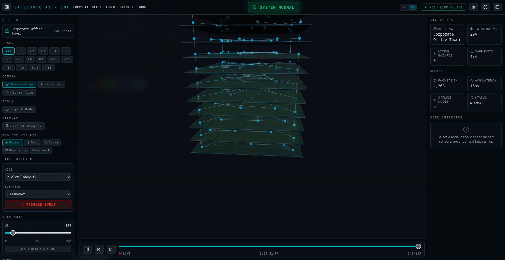
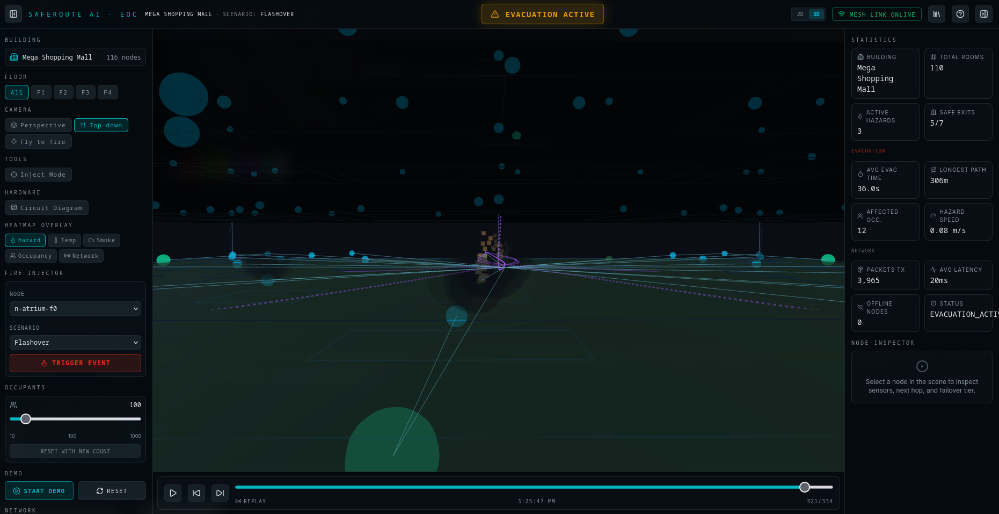
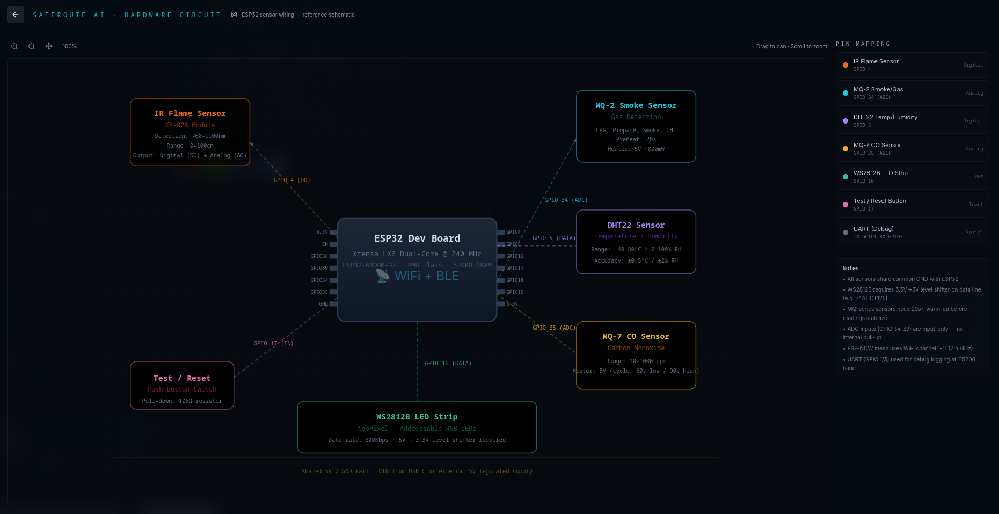
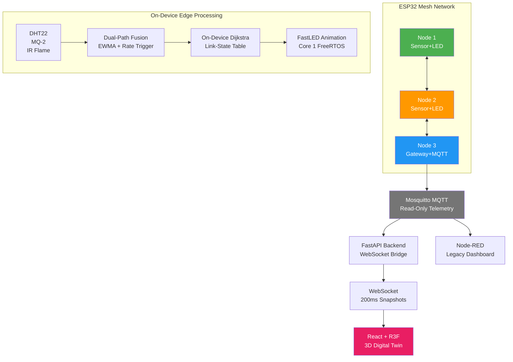

# SafeRouteAI — Dynamic Fire Evacuation Router

[](LICENSE)
[](https://www.espressif.com/)
[](https://fastapi.tiangolo.com/)
[](https://react.dev/)
[](https://python.org)
[](https://isocpp.org/)
[](CONTRIBUTING.md)

---

Decentralized, self-healing evacuation-routing system for commercial buildings. Each ESP32 node senses local fire hazard, fuses it into a continuous exponential cost, shares it with mesh neighbors via ESP‑NOW, and independently runs Dijkstra to compute the safest exit path. **No central server decides a path** — the dashboard is read-only telemetry.

---

## Screenshots

| Stable Monitoring | Evacuation Routing | Circuit View |
|---|---|---|
|  |  |  |

---

## Architecture



### Data Flow

```
Sensors → Dual-Path Conditioning → Sensor Fusion → Edge Cost →
  Update Link-State → Flood ESP-NOW (TTL=4) →
  Dijkstra Recompute → Hold-Down Check → LED Decision →
  Gateway → MQTT → Backend → WebSocket → Frontend
```

---

## Technology Stack

| Layer | Technology | Purpose |
|-------|------------|---------|
| MCU | ESP32 + Arduino Framework | Edge processing, sensor fusion, LED control |
| Mesh Protocol | ESP-NOW | Sub-10ms connectionless peer-to-peer flooding |
| Sensors | DHT22, MQ-2, IR Flame | Temperature, smoke concentration, flame detection |
| Visual Guidance | WS2812B (FastLED) | Color-coded evacuation path animation |
| Backend | FastAPI (Python) | MQTT→WebSocket bridge, state aggregation, REST API |
| Frontend | React 19 + Three.js (R3F) | 3D digital twin visualization |
| Dashboard | Node-RED | Legacy 2D floor-grid monitoring |
| MQTT Broker | Mosquitto | Read-only telemetry transport |
| Simulator | Python + NumPy | Fire injection, hardware-in-the-loop testing |
| Containerization | Docker Compose | Multi-service orchestration |
| Firmware Build | PlatformIO | Cross-compilation, dependency management |

---

## Quick Start

### Prerequisites

- PlatformIO (firmware build/flash)
- Python 3.10+ (backend + simulator)
- Node.js 18+ or [Bun](https://bun.sh) (frontend)
- Docker (Mosquitto MQTT + Node-RED)
- ESP32 dev board (optional — mock mode works without hardware)

### Full-Stack Demo (No Hardware Needed)

```bash
# 1. Install backend dependencies
pip install -r backend/requirements.txt

# 2. Install simulator dependencies
pip install -r simulator/requirements.txt

# 3. Install frontend dependencies
cd frontend && bun install && cd ..

# 4. Start all services
./scripts/start-demo.sh
```

The frontend runs in **mock mode** by default (`VITE_USE_MOCK=true`). Switch to live mode by setting `VITE_USE_MOCK=false` in `frontend/.env`.

### Quick Reference

| Step | Command |
|------|---------|
| Backend (manual) | `uvicorn backend.main:app --host 0.0.0.0 --port 8000 --reload` |
| Frontend (manual) | `cd frontend && bun run dev` |
| Build firmware | `pio run --environment esp32dev` |
| Flash firmware | `pio run --target upload --environment esp32dev` |
| Serial monitor | `pio device monitor` |
| Run all tests | `./scripts/run-all-tests.sh` |
| Fire injector CLI | `python3 simulator/injector.py --cli` |
| Node-RED only | `cd docker && docker-compose up -d mosquitto nodered` |

### Service URLs

| Service | URL |
|---------|-----|
| Frontend (3D Digital Twin) | http://localhost:5173 |
| Backend API | http://localhost:8000 |
| API Documentation (Swagger) | http://localhost:8000/docs |
| Node-RED Dashboard | http://localhost:1880 |
| MQTT Broker | `localhost:1883` |

---

## Repository Structure

```
├── firmware/           # ESP32 C/C++ (PlatformIO)
│   ├── src/            # main, routing, fusion, comms, leds, failsafe, gateway
│   ├── include/        # HazardPacket, graph_topology, link_state, routing, etc.
│   └── platformio.ini
├── backend/            # FastAPI → WebSocket bridge (MQTT ↔ frontend)
│   ├── main.py         # REST + WebSocket endpoints
│   ├── mqtt_bridge.py  # MQTT subscriber + Snapshot aggregation
│   ├── engine.py       # SimState, hazard diffusion, Dijkstra
│   ├── models.py       # Pydantic v2 data models
│   └── requirements.txt
├── frontend/           # React 19 + Vite + R3F digital twin
│   ├── src/
│   │   ├── api/        # SafeRouteApi interface, mock, HTTP client
│   │   ├── components/ # 3D scene, panels, overlays
│   │   ├── stores/     # Zustand (useTwinStore, useUiStore)
│   │   └── three/      # Three.js scene setup
│   └── package.json
├── simulator/          # Python fire injection tool
│   ├── injector.py     # CLI fire simulation injector
│   ├── graph_model.py  # Building topology model
│   ├── fire_profiles/  # slow-smolder, flashover, regression
│   └── data/           # building_graph.json
├── dashboard/          # Node-RED flow + UI panels
│   ├── flows.json      # Node-RED import file
│   └── ui/             # floor grid, health panel, shelter panel
├── docs/               # Comprehensive documentation
│   ├── architecture.md # System architecture with Mermaid diagrams
│   ├── firmware.md     # Firmware task layout, routing, timing budget
│   ├── backend.md      # Backend components, MQTT bridge, WebSocket
│   ├── frontend.md     # React/R3F rendering pipeline, stores
│   ├── api.md          # Full REST + WebSocket API reference
│   ├── protocol.md     # Wire format, sequence numbers, CRC16
│   ├── mathematics.md  # Cost formulas, sensor fusion, IDW
│   ├── hardware.md     # Components, pin mapping, wiring, BOM
│   ├── simulation.md   # Fire injector, profiles, test scenarios
│   ├── setup.md        # Environment setup and configuration
│   ├── deployment.md   # Production deployment guide
│   ├── testing.md      # Test suite catalog and methodology
│   ├── screenshots/    # Dashboard screenshots
│   └── engineering_report.md  # Formal engineering report
├── tests/              # Backend, firmware ref, simulator, integration tests
├── test/               # On-device firmware C++ tests (Unity)
├── docker/             # Dockerfiles and service configs
├── scripts/            # Build, test, demo shell scripts
├── .github/            # CI workflows, issue/PR templates
├── LICENSE             # MIT License
├── CONTRIBUTING.md     # Contribution guidelines
├── CHANGELOG.md        # Release history
├── SECURITY.md         # Security policy
├── CODE_OF_CONDUCT.md  # Community standards
└── ROADMAP.md          # Project roadmap
```

---

## Key Design Decisions

| Decision | Rationale |
|----------|-----------|
| **Read-only telemetry path** | Backend and dashboard are **never** on the safety decision path. All routing, fusion, and fail-safe logic executes on the ESP32 mesh. A network partition does not affect evacuation. |
| **Double-buffered link-state table** | Lock-free atomic pointer swap between active/inactive buffers. ESP-NOW callback writes inactive buffer; loop atomically swaps and reads. No mutex contention. |
| **Dual-path detection** | EWMA slow path (α=0.3) rejects sensor noise; rate-of-change fast path with 2-sample debounce catches flashover within 100ms. Neither path alone suffices — together they handle both noise and speed. |
| **Continuous exponential cost** | No binary thresholds in temperature or smoke. Edge cost increases exponentially with hazard severity, giving Dijkstra smooth gradient information. Flame detection adds a 1e6 block multiplier. |
| **Hold-down hysteresis (1800ms)** | Prevents LED animation flicker when cost oscillates near a decision boundary. A node must sustain a better path for ≥1800ms before switching. |
| **Three-tier sensor fail-safe** | Tier 1: local sensor (healthy). Tier 2: neighbor consensus (local faulty). Tier 3: static default (isolated node). Graceful degradation at every level. |
| **CRC16 + seq_num anti-replay** | Every packet validated at every hop. CRC16 (polynomial 0x8005) catches corruption; RFC 1982 sequence numbers reject stale/duplicate packets. |
| **FreeRTOS core pinning** | LED animation task pinned to Core 1 ensures smooth visual guidance without blocking Core 0's pathfinding and communication. |

---

## Performance Characteristics

| Stage | p95 Latency | Worst-Case |
|-------|-------------|------------|
| Sensor read + fusion | 6 ms | 8 ms |
| Threshold check | 1 ms | 1 ms |
| Dijkstra recompute | 18 ms | 25 ms |
| ESP-NOW per hop | 15 ms | 35 ms |
| LED update | 6 ms | 8 ms |
| **4-hop end-to-end** | **91 ms** | **182 ms** |
| Hold-down timer | 1,800 ms | 1,800 ms |
| SIH requirement | — | < 300 ms |

---

## Benchmark & Evaluation Criteria Coverage

| Criterion | Weight | Implementation |
|-----------|--------|----------------|
| Algorithm Responsiveness & Sensor Fusion | 30% | On-device Dijkstra (priority queue), continuous exponential edge cost, dual-path EWMA+rate detection |
| Simulation Quality & Demonstration | 20% | Python injector with 2 fire profiles (slow smolder, flashover), CLI zone control, packet corruption injection |
| Visual Interface & Usability | 15% | LED chase animation, color-coded guidance (green/yellow/red/white), 3D digital twin, 2D floor grid |
| Solution Pitch & Presentation | 15% | Engineering report with flowchart, 16-slide deck, speaker notes with Q&A preparation |
| Multi-Node Communication | 10% | ESP-NOW mesh flooding, sequence number anti-replay, CRC16 validation at every hop |
| Fail-Safe Operation | 10% | 3-tier sensor health, corrupt packet rejection, link-state aging, isolated-node fallback |

---

## Project Highlights

- **Decentralized mesh architecture** — no single point of failure; every node operates independently
- **Sub-100ms end-to-end hazard response** — flashover detection and reroute in under 100ms (p95)
- **On-device Dijkstra** with continuous exponential edge weights — no cloud dependency for routing decisions
- **3-tier sensor fail-safe** — local sensor → neighbor consensus → static default fallback
- **Production-grade 3D digital twin** — React + Three.js frontend with real-time WebSocket updates
- **Multi-building support** — 5 commercial building layouts (mall, hospital, office, university, airport)
- **25+ automated tests** — cross-validated golden cost formula across firmware C++, Python backend, and test suite
- **Docker Compose orchestration** — Mosquitto + Backend + Frontend + Node-RED in 4 commands
- **Hardware-in-the-loop ready** — mock mode for development, live mode for physical ESP32 mesh

---

## Documentation

| Guide | Description |
|-------|-------------|
| [Architecture](docs/architecture.md) | System layers, communication flow, data flow, safety architecture |
| [API Reference](docs/api.md) | All REST endpoints with request/response examples and error codes |
| [Firmware Guide](docs/firmware.md) | FreeRTOS tasks, routing algorithm, LED state machine, timing budget |
| [Hardware Guide](docs/hardware.md) | Component specs, pin mapping, wiring diagram, BOM |
| [Backend Guide](docs/backend.md) | Component overview, MQTT bridge, WebSocket, thread safety |
| [Frontend Guide](docs/frontend.md) | React/R3F rendering pipeline, Zustand stores, mock vs live mode |
| [Protocol](docs/protocol.md) | Wire format, sequence numbers, CRC16, MQTT topics |
| [Mathematics](docs/mathematics.md) | Cost formulas, sensor fusion math, IDW interpolation |
| [Simulation](docs/simulation.md) | Fire injector CLI, fire profiles, test scenarios |
| [Setup Guide](docs/setup.md) | Development environment setup and configuration |
| [Deployment Guide](docs/deployment.md) | Production architecture, Docker Compose, nginx, security |
| [Testing Guide](docs/testing.md) | Test suite catalog, methodology, how to add tests |
| [Engineering Report](docs/engineering_report.md) | Formal engineering analysis with scalability discussion |

---

## Troubleshooting

| Problem | Likely Cause | Solution |
|---------|--------------|----------|
| Frontend shows no data | Mock mode disabled, backend not running | Ensure `VITE_USE_MOCK=true` in `frontend/.env` or start backend |
| Backend fails to start | Missing dependencies | Run `pip install -r backend/requirements.txt` |
| MQTT connection error | Mosquitto not running | Run `docker compose up -d mosquitto` |
| Firmware build fails | PlatformIO not installed | Run `pip install platformio` |
| WebSocket disconnects | Backend restarted | Frontend auto-reconnects within 3 seconds |
| Injector shows no output | Backend not connected to MQTT | Ensure Mosquitto and backend are running |

---

## Contributing

See [CONTRIBUTING.md](CONTRIBUTING.md) for development workflow, code style,
testing requirements, and pull request process.

## Roadmap

See [ROADMAP.md](ROADMAP.md) for planned features, improvements, and
long-term vision.

## License

[MIT](LICENSE) © 2026 SafeRouteAI
