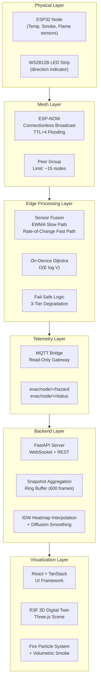
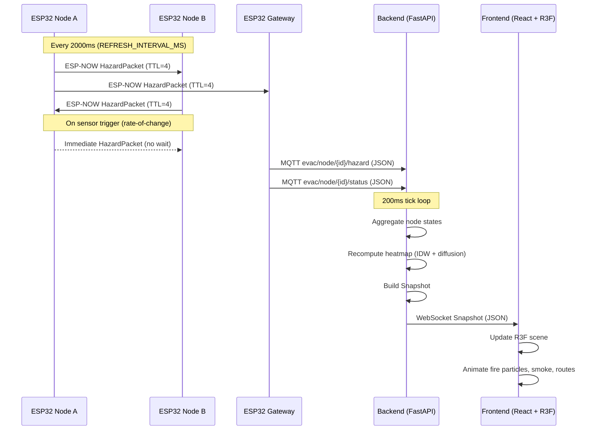
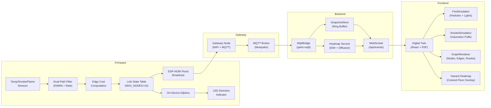
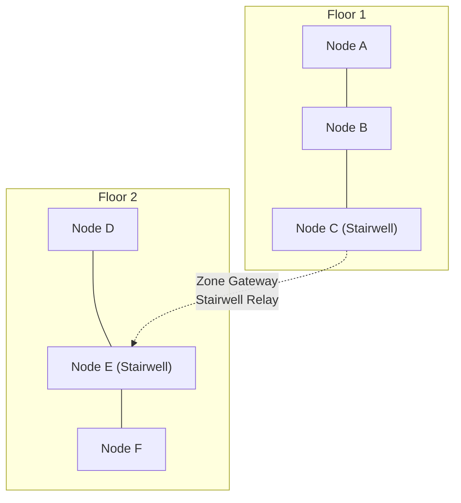
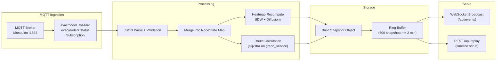
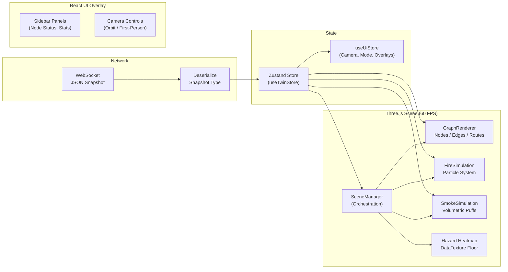
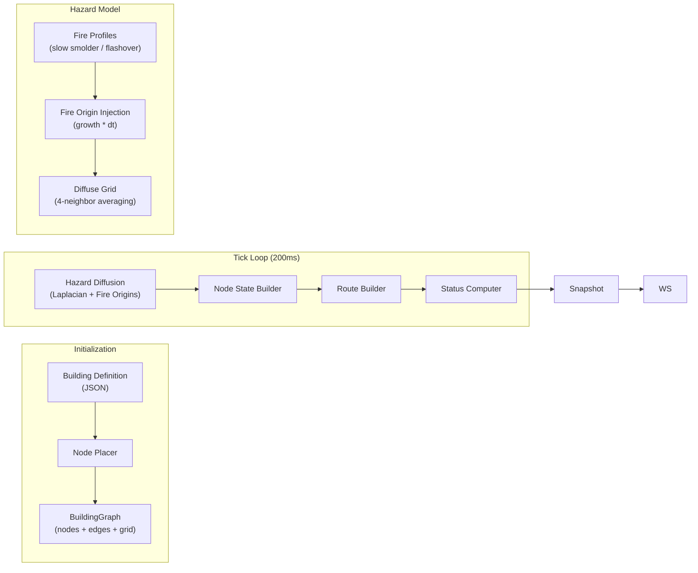
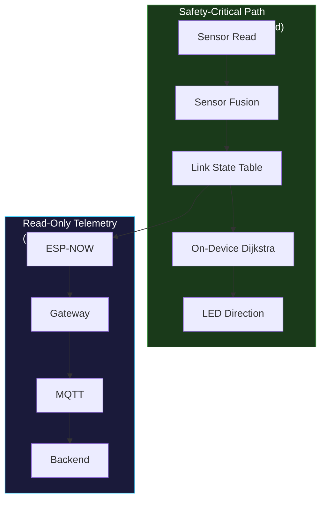

# SafeRouteAI — System Architecture

## 1. System Overview

SafeRouteAI is a **decentralized, mesh-based emergency evacuation routing system** with zero single points of failure. Every ESP32 node independently senses its local environment, fuses multi-sensor data into a hazard cost, floods that state across a peer-to-peer ESP-NOW mesh, and runs on-device Dijkstra to compute the safest exit path. The mesh is **decision-autonomous**: all routing decisions happen on-device. The backend and frontend layers are **read-only observers** that provide situational awareness and a 3D digital twin.

### Design Tenets

| Principle | Implication |
|-----------|-------------|
| No single point of failure | Every node makes its own routing decision; gateway loss does not impair evacuation |
| Read-only telemetry path | Backend never sends routing commands to nodes |
| All decisions on-device | Dijkstra runs on every ESP32, not on a server |
| Exponential hazard cost | Continuous (not binary) cost function avoids threshold flicker |
| Hold-down hysteresis | 1800ms debounce prevents route oscillation under transient sensor noise |

---

## 2. System Layers



---

## 3. Communication Flow



---

## 4. Data Flow



---

## 5. Mesh Topology

The ESP-NOW mesh uses **connectionless broadcast** with no routing tables at the link layer. Each node transmits on WiFi channel 1 with a peer limit of ~15 nodes.

### Peer Group Architecture

- **Maximum peers per node:** 15 (`MAX_PEERS`)
- **Maximum tracked nodes:** 15 (`MAX_NODES`)
- **Broadcast method:** Raw ESP-NOW `esp_now_send()` to MAC `FF:FF:FF:FF:FF:FF`
- **Ring topology:** All peers within range receive every broadcast
- **Multi-floor:** Floor transitions handled by zone gateways (stairwell nodes) that relay between floors
- **No mesh routing protocol:** ESP-NOW is datagram-only; multi-hop is achieved via TTL flooding

### Multi-Floor Strategy



Stairwell nodes serve as **zone gateways** — they participate in both floor meshes and relay packets between floors, but are **never on the decision path**. Their only role is forwarding.

---

## 6. Backend Pipeline



### Pipeline Steps (5Hz tick)

1. **MQTT Ingestion** — `MqttBridge` subscribes to `evac/node/+/hazard` and `evac/node/+/status` via paho-mqtt
2. **JSON Parse** — Incoming MQTT messages parsed into `NodeState` objects; CRC failures counted
3. **Node State Merge** — New state merged into per-node map (keyed by string ID)
4. **Heatmap Recompute** — Every 500ms, `interpolate_heatmap()` runs IDW per floor, then `diffuse_grid()` smooths
5. **Route Calculation** — Dijkstra run from up to 9 source nodes to find nearest exit
6. **Snapshot Build** — All state assembled into a `Snapshot` Pydantic model
7. **WebSocket Broadcast** — Snapshot pushed to all connected frontends
8. **Ring Buffer Append** — Snapshot stored for replay (up to 600 frames)

---

## 7. Frontend Rendering Pipeline



### Render Loop (per frame)

1. **WebSocket message** → Zustand store updates
2. **GraphRenderer.tick(dt, snapshot)** — Node colors pulse, route arrows animate along Catmull-Rom curves
3. **FireSimulation.tick(dt)** — 60 particles per fire node with velocity, lifetime, flicker light
4. **SmokeSimulation.tick(dt)** — Pool of 120 pre-allocated puffs, expand + fade + wind drift
5. **SceneManager.render** — Three.js render with ACES filmic tone mapping, PCFSoft shadows
6. **Frame budget:** 16ms target, delta clamped to 50ms max

---

## 8. Digital Twin Architecture

The digital twin is a **React + R3F (React Three Fiber)** 3D scene that mirrors the physical building in real time.

### Scene Composition

| Component | Technology | Responsibility |
|-----------|-----------|----------------|
| SceneManager | R3F + Three.js | Camera, renderer, animation loop, diagnostics |
| GraphRenderer | Three.js | Building graph overlay (nodes, edges, routes) |
| FireSimulation | Three.js Points | Particle fire at each active hazard node |
| SmokeSimulation | Three.js Mesh pool | Volumetric smoke puffs with propagation |
| LightingManager | Three.js | Ambient + directional + fire flicker lights |
| AssetManager | R3F | GLTF building geometry, texture loading |
| CoordinateSystem | TypeScript | Building-plane coordinate normalization |

### Camera Modes

- **Orbit** — Default, spherical orbit around building center
- **First-Person** — WASD controls at human eye height
- **Top-Down** — Orthographic override for overview
- **Firefighter** — Focused view on most severe hazard with path overlay

### Performance Budget

| Metric | Target |
|--------|--------|
| Draw calls | < 200 |
| Triangle count | < 500K |
| Texture memory | < 64 MB |
| Particles | < 10,000 |
| Frame time | < 16 ms |

---

## 9. Simulation Engine Architecture

The simulation engine (`backend/engine.py`) provides a **deterministic building-aware hazard model** that runs when no physical hardware is connected.



## 10. Gateway Responsibilities

The ESP32 gateway is **solely a telemetry bridge**. It is never on the routing decision path.

| Responsibility | Detail |
|---------------|--------|
| WiFi station | Connects to infrastructure WiFi (AP: `SafeRouteAI`) |
| MQTT bridge | Publishes HazardPacket data as JSON on `evac/node/{id}/hazard` |
| Status reporting | Publishes sensor health status on `evac/node/{id}/status` |
| Reconnection | Retries MQTT broker connection on disconnect |
| **Excluded from** | Dijkstra computation, route decisions, evacuation logic |

```cpp
// gateway.cpp — publish-only, no routing involvement
void gateway_publish_hazard(const HazardPacket *pkt) {
    snprintf(topic, sizeof(topic), "evac/node/%u/hazard", pkt->node_id);
    mqtt_client.publish(topic, payload);  // read-only telemetry
}
```

---

## 11. Firmware Responsibilities

Every non-gateway ESP32 node executes the full decision pipeline locally.

| Responsibility | Module | Details |
|---------------|--------|---------|
| Sensor reading | `sensor_drivers.cpp` | DHT22 (temp), MQ2 (smoke), flame sensor (ADC) |
| Sensor fusion | `fusion.cpp` | Dual-path EWMA + rate-of-change detection |
| Sensor health | `fusion.cpp` | Variance-based stuck detection, physical range check |
| Fail-safe | `failsafe.cpp` | 3-tier degradation (local → neighbor consensus → static) |
| Link state | `link_state.cpp` | Table of up to 15 peer entries, aged at 6s timeout |
| Routing | `routing.cpp` | On-device Dijkstra with exponential cost |
| Hold-down | `routing.cpp` | 1800ms hysteresis to prevent route oscillation |
| LED indication | `leds.cpp` | WS2812B strip: green (safe), yellow (caution), red (fire), white strobe (shelter) |
| Comms | `comms.cpp` | ESP-NOW broadcast with CRC validation and sequence anti-replay |
| Hazard packet | `HazardPacket.cpp` | 26-byte packed struct with CRC16 |

### Main Loop

```cpp
void loop() {
    read_sensors();
    sensor_state_update(...);
    dual_path_update(&temp_filter, current_temp);
    dual_path_update(&smoke_filter, current_smoke);

    // Compute edge cost from normalized sensor values
    hazard = compute_edge_cost(T_norm, S_norm, O_norm, ...);

    // Broadcast to mesh (on trigger or every 2000ms)
    if (triggered || (now - last_refresh >= 2000)) {
        HazardPacket tx = { .crc16 = hazard_packet_crc16(&tx) };
        comms_broadcast(&tx);
    }

    // Run on-device Dijkstra
    DijkstraResult result = routing_compute(own_id, &link_state_table, &building_graph);
    leds_set_command(choose_led_state(&edge_decision, &result));
}
```

---

## 12. Safety Architecture

### Critical Safety Properties



### Key Safety Guarantees

| Guarantee | Mechanism | Evidence |
|-----------|-----------|----------|
| **No single point of failure** | Every node runs full Dijkstra independently | `routing.cpp:routing_compute()` |
| **Backend outage → no impact** | Backend is read-only observer | `gateway.cpp` never receives routing commands |
| **Sensor failure → graceful degradation** | 3-tier failover: local → neighbor → static | `failsafe.cpp` |
| **Stuck sensor detection** | Variance check on 10-sample ring buffer | `fusion.cpp:sensor_health_update()` |
| **No route oscillation** | 1800ms hold-down timer | `routing.cpp:hold_down_should_switch()` |
| **Flame = hard block** | 1e6 cost multiplier | `routing.cpp` line 22-24 |
| **Shelter-in-place** | Cost threshold at 100,000 | `routing.cpp` line 143-147 |
| **Packet corruption rejection** | CRC16 with polynomial 0x8005 | `HazardPacket.cpp` |
| **Replay attack prevention** | RFC 1982 sequence number arithmetic | `comms.cpp:seq_num_accept()` |
| **Stale node handling** | 6s timeout → cost linearly increases | `link_state.cpp` |

### Failover Tiers

| Tier | Condition | Action |
|------|-----------|--------|
| **Tier 1** — Local Sensor | All sensors healthy | Use own sensor readings for edge cost |
| **Tier 2** — Neighbor Consensus | Temp or smoke sensor fault | Use peer hazard data for routing (static cost 50,000) |
| **Tier 3** — Static Default | Complete sensor failure | Fixed cost 50,000, fallback to static exit direction |

### Communication Loss Handling

When a peer's packets stop arriving (6s timeout), the link state table does NOT mark the node as having a flame. Instead, the edge cost is decayed upward:

```cpp
if (elapsed > STALE_TIMEOUT_MS) {
    float age_ratio = min((elapsed - STALE_TIMEOUT_MS) / 60000.0f, 1.0f);
    tbl->entries[i].edge_cost *= (1.0f + age_ratio * 10.0f);
    // flame_detected is NOT set here — see link_state.cpp:42-50
}
```

This ensures that a node with dead comms is **routed around** (via higher cost) but not treated as an **active fire** (which would block the edge entirely).
