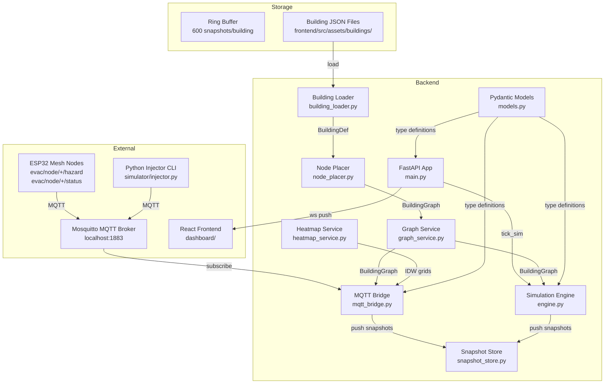

# SafeRouteAI Backend

## Overview

The backend is a FastAPI async service that acts as an MQTT-to-WebSocket bridge, simulation engine, and REST API provider. It maintains per-building `SimState` instances with independent hazard grids, runs a 200ms tick loop, and pushes `Snapshot` objects to connected WebSocket clients.

## Architecture



## Component List

### `main.py`
Entry point. Creates the FastAPI application with a lifespan that starts an async tick loop at 200ms. Maintains per-building dictionaries for `SimState`, `SnapshotStore`, and WebSocket connections. Exposes REST endpoints and a WebSocket endpoint.

Key invariants:
- `_tick_loop()` iterates all buildings every 200ms, calls `tick_sim()`, stores the snapshot, and broadcasts to all WS clients for that building
- Dead WebSocket connections are lazily cleaned during tick
- Demo task is cancellable and runs multi-stage scenario injection

### `mqtt_bridge.py`
MQTT subscriber connecting to Mosquitto on `localhost:1883`. Subscribes to `evac/node/+/hazard` and `evac/node/+/status`. Parses hazard messages (temp, smoke, flame, cost) into `NodeState` objects and status messages for node health. Aggregates into a unified `Snapshot` with computed evacuation routes and IDW-interpolated heatmap grids.

Thread safety: All shared state access is guarded by `self._lock` (threading.Lock). Heatmap recomputation is throttled to every 500ms. The MQTT client runs `loop_start()` in a background thread.

### `engine.py`
Building-aware simulation engine. Each `SimState` holds an isolated hazard diffusion grid, fire origins, disabled sensor/comm sets, and packet counters. Core functions:

- `tick_sim(sim)` — Advances simulation by one frame: diffuses hazard, builds node states with computed next hops, computes Dijkstra routes, determines status
- `diffuse_hazard(sim, dt)` — 2D grid diffusion with source injection at fire origin cells. Flashover grows at 0.35/tick, slow smolder at 0.05/tick
- `compute_edge_cost(sim, from_node, to_node)` — Exponential cost function: `dist * exp(2.2*T_norm + 1.6*S_norm) + 0.5*O_norm*dist`. Flaming edges multiplied by 1e6
- `_dijkstra(sim, source_id)` — Full Dijkstra returning distance map and nearest exit. Matches firmware `routing.cpp` constants
- `inject_hazard(sim, node_id, scenario)` — Adds fire origin or disables sensor/comm
- `reset_sim(sim)` — Clears all state back to baseline

### `models.py`
Pydantic v2 models shared across the backend:

| Model | Fields | Purpose |
|-------|--------|---------|
| `Vec3` | x, y, z | 3D position |
| `BuildingNode` | id, kind, floor, position, label | Graph node (sensor/hallway/exit/stairwell) |
| `BuildingEdge` | id, from_node, to_node | Graph edge |
| `Room` | id, x, z, width, depth, label, type | Floor plan room |
| `FloorPlanRoomSeg` | from_, to, width | Corridor segment |
| `FloorPlan` | index, name, size, origin, rooms, corridors | Single floor |
| `BuildingGraph` | id, name, floors, nodes, edges, hazardGrid | Complete building topology |
| `BuildingMeta` | id, name, type, description, floors, totalRooms, totalExits | Building listing |
| `BuildingDefRoom` | id, label, type, floor, x, z, width, depth, isExit, isStairwell, capacity | Raw building room |
| `CorridorDef` | id, fromRoom, toRoom, floor, width, junctionPoints, isStairwell | Raw corridor |
| `BuildingDefFloor` | index, name, elevation, width, depth | Raw floor |
| `BuildingDef` | meta, rooms, corridors, floors | Complete raw building |
| `NodeState` | nodeId, online, temperature, smoke, co, flameDetected, occupants, nextHop, failoverTier, lastSeenMs, sensorOk | Live node status |
| `EvacRoute` | id, path, priority | Evacuation path |
| `NetworkStats` | totalPackets, packetsPerSec, crcFailures, staleNodes, avgLatencyMs, websocket | Network metrics |
| `Snapshot` | t, status, scenario, nodes, hazard, routes, network, activeFireNodes | Full state snapshot |
| `InjectRequest` | nodeId, scenario | Injection command body |
| `TimeRange` | fromMs, toMs | Replay query range |

### `graph_service.py`
Facade that combines `building_loader.py` and `node_placer.py`. Provides:

- `list_buildings()` — Returns `BuildingMeta` list from index
- `load_graph(building_id)` — Loads building def, converts to `BuildingGraph`
- `get_string_id(numeric_id)` / `get_numeric_id(string_id)` — Bidirectional ID mapping between ESP32 numeric IDs and string node IDs

### `node_placer.py`
Converts `BuildingDef` (raw room/corridor topology) into `BuildingGraph` (nodes + edges + floor plans). Python port of the frontend's `nodePlacer.ts`. Processing steps:

1. Places nodes at room centers (sensor nodes for plain rooms, exit nodes for exits, stairwell nodes for stairwells)
2. Adds junction nodes for corridor waypoints
3. Creates edges between rooms connected by corridors
4. Connects stairwells vertically between floors
5. Centers the building at origin

### `building_loader.py`
Loads building definitions from JSON files at `frontend/src/assets/buildings/<id>/building.json`. Uses `frontend/src/assets/buildings/index.json` for building metadata. Caches loaded `BuildingDef` objects and the building index.

### `heatmap_service.py`
Inverse Distance Weighting (IDW) interpolation that transforms per-node hazard values into a 32×22 per-floor grid. Functions:

- `interpolate_heatmap(graph, nodes, floor)` — For each grid cell, computes weighted average of nearby node hazards using `1/d²` weights
- `diffuse_grid(grid, dt)` — Simple 4-neighbor blur that spreads hazard values outward

Replicates the diffusion algorithm from the frontend's `mockApi.ts` for visual consistency.

### `snapshot_store.py`
Thread-safe ring buffer storing the last 600 snapshots per building for replay scrubbing. Uses a `threading.Lock` for all operations. Methods:

- `push(snapshot)` — Append, trim to 600 max
- `get_all()` — Return copy of all snapshots
- `get_range(from_ms, to_ms)` — Filter by timestamp window
- `latest()` — Return most recent snapshot
- `clear()` — Empty the buffer

## Multi-Building Support

Five distinct building layouts are loaded from the frontend assets directory:

| Building ID | Type | Floors | Rooms | Exits |
|-------------|------|--------|-------|-------|
| `mega-mall` | Shopping Mall | 4 | 110 | 7 |
| `city-hospital` | Hospital | 6 | 145 | 5 |
| `office-tower` | Office Tower | 15 | 204 | 4 |
| `university-block` | University Block | 7 | 161 | 6 |
| `airport-terminal` | Airport Terminal | 5 | 131 | 8 |

Each building gets its own isolated `SimState`, `SnapshotStore`, and WebSocket connection list. All REST and WS endpoints accept an optional `buildingId` query parameter (defaults to `mega-mall`).

## MQTT Bridge Details

### Connection
- Broker: `localhost:1883`
- Client: paho-mqtt with `loop_start()` background thread

### Subscribed Topics
- `evac/node/+/hazard` — Sensor hazard readings (temp, smoke, flame, cost)
- `evac/node/+/status` — Node health/FAULT messages

### Hazard Message Parsing
```python
{
    "node_id": int,     # Numeric ESP32 node ID
    "temp": float,      # Temperature in °C
    "smoke": float,     # Smoke level (raw ADC or PPM)
    "flame": bool,      # Flame detection flag
    "cost": float       # Edge cost (optional)
}
```

### Status Message Parsing
Payload containing "FAULT" marks the node as sensor-failed and sets its failover tier to "tertiary".

### Thread Safety
All state mutations (node states, health, fire nodes, heatmap grids) happen under `self._lock`. The `tick()` method acquires the lock to build a consistent snapshot. Heatmap recomputation is throttled to 500ms intervals.

## WebSocket Protocol

### Connection
```
WS /api/events?buildingId=mega-mall
```

### Message Format (Server → Client)
Push every 200ms as JSON:

```json
{
    "t": 1712345678000,
    "status": "EVACUATION_ACTIVE",
    "scenario": "flashover",
    "nodes": {
        "n-zone-1": {
            "nodeId": "n-zone-1",
            "online": true,
            "temperature": 245.3,
            "smoke": 0.87,
            "co": 740.0,
            "flameDetected": true,
            "occupants": 12,
            "nextHop": "j-corridor-a-0",
            "failoverTier": "secondary",
            "lastSeenMs": 1712345678000,
            "sensorOk": true
        }
    },
    "hazard": {
        "0": [0.0, 0.05, 0.12, ...],
        "1": [0.0, 0.0, 0.0, ...]
    },
    "routes": [
        {"id": "route-n-zone-1", "path": ["n-zone-1", "j-corridor-a-0", "exit-north"], "priority": 0.85}
    ],
    "network": {
        "totalPackets": 1523,
        "packetsPerSec": 45,
        "crcFailures": 3,
        "staleNodes": 1,
        "avgLatencyMs": 14.5,
        "websocket": "connected"
    },
    "activeFireNodes": ["n-zone-1"]
}
```

### Client → Server Messages
Clients can send JSON with an `inject` key to trigger hazards:

```json
{"inject": {"nodeId": "n-zone-1", "scenario": "flashover"}}
```

### Building Filtering
The `buildingId` query parameter on the WS URL determines which building's snapshots the client receives. There is no multi-building broadcast.

## Data Flow

```
MQTT Broker
    │
    ▼
mqtt_bridge._on_mqtt_message()
    │  (acquires lock)
    ├─ _handle_hazard() → updates NodeState
    ├─ _handle_status() → updates node health
    │  (releases lock)
    ▼
mqtt_bridge.tick()
    │  (acquires lock)
    ├─ _recompute_heatmaps() (throttled 500ms)
    ├─ _compute_routes() → Dijkstra on all active nodes
    └─ _build_snapshot() → Snapshot object
    │  (releases lock)
    ▼
snapshot_store.push(snapshot)
    │
    ▼
Callback → notify WebSocket listeners
```

When the MQTT broker is unavailable, the simulation engine (`engine.py`) keeps running from its own tick loop, providing standalone mock data.

## Thread Safety Model

| Component | Mechanism | Scope |
|-----------|-----------|-------|
| `mqtt_bridge.py` | `threading.Lock` | All node state, health, fire nodes, heatmap grids |
| `snapshot_store.py` | `threading.Lock` | Ring buffer push/get/clear |
| `main.py` | asyncio (single-threaded) | WS connections, tick loop, REST handlers |
| `engine.py` | No locks (called from async context) | SimState mutations only from tick loop |

The MQTT bridge runs in a paho background thread and uses a lock to safely share data with the rest of the system. The FastAPI async handlers and tick loop run on the main event loop thread and do not need locks for SimState access since they are sequential.
