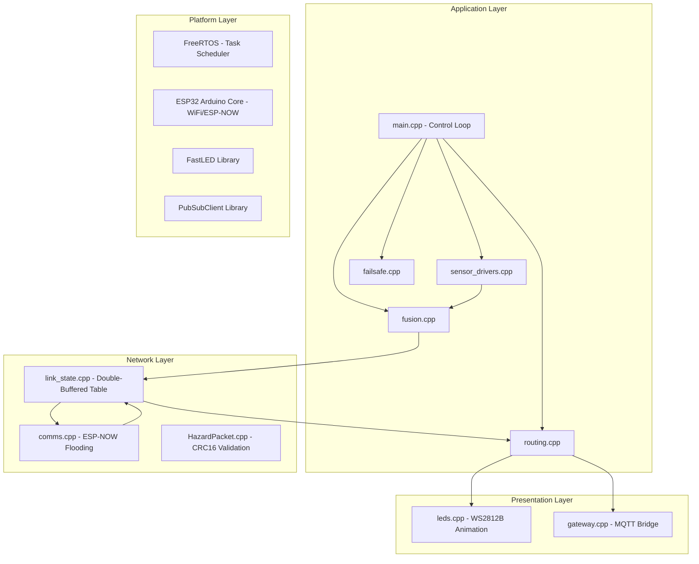
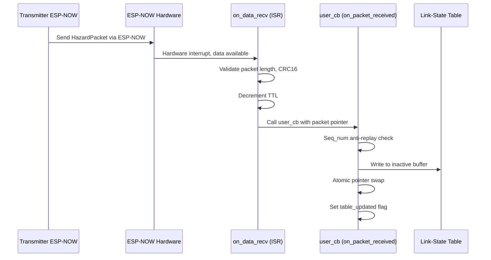
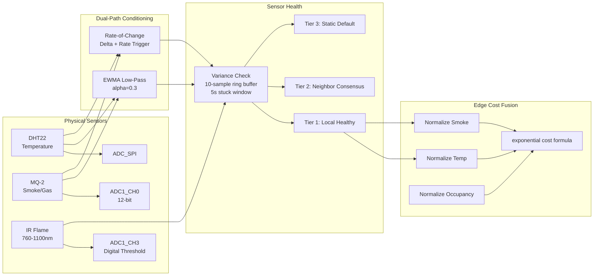
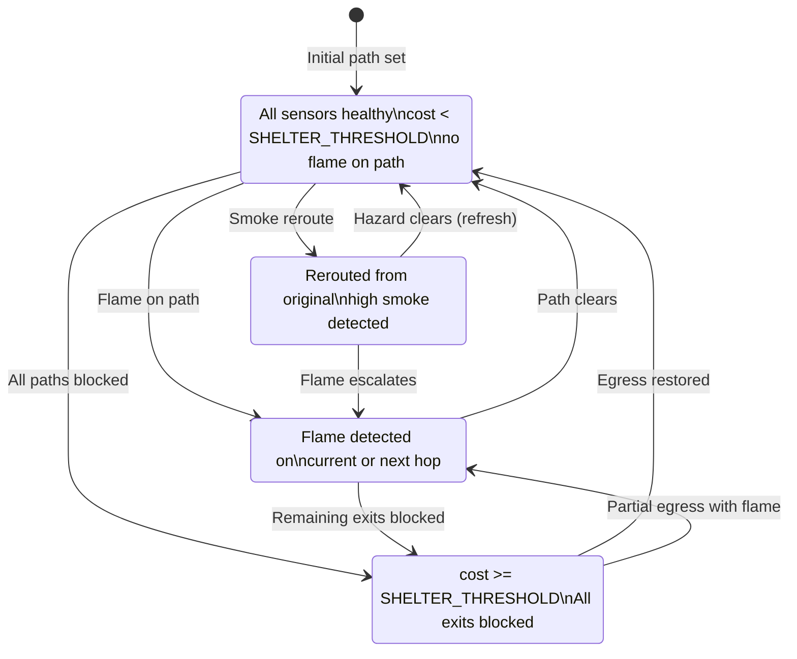
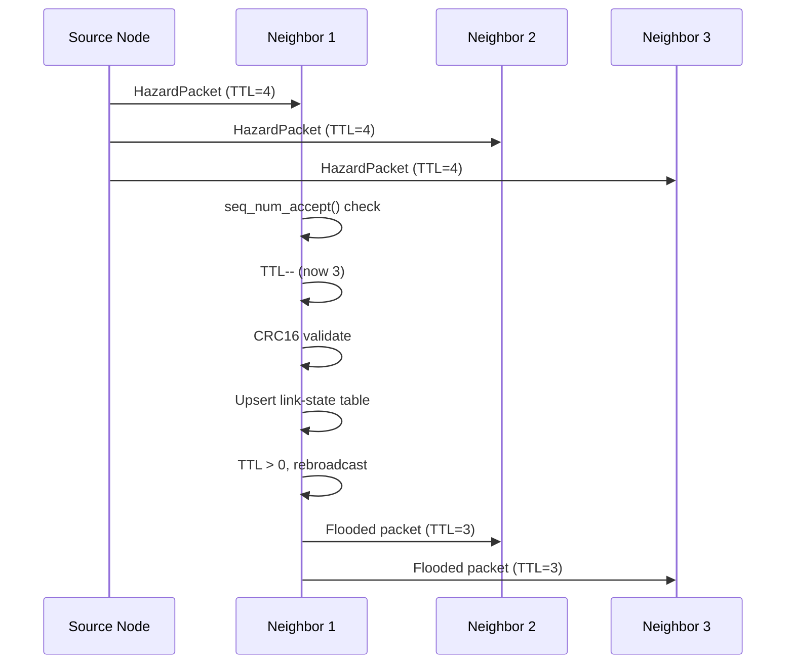
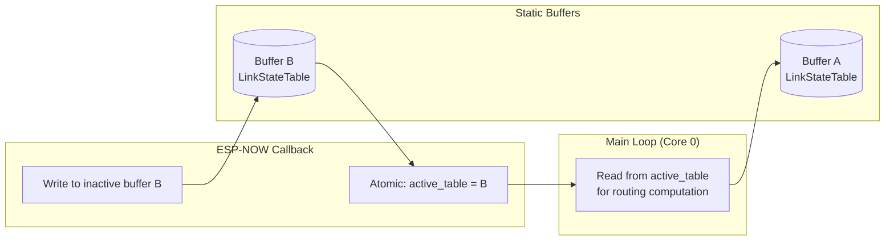
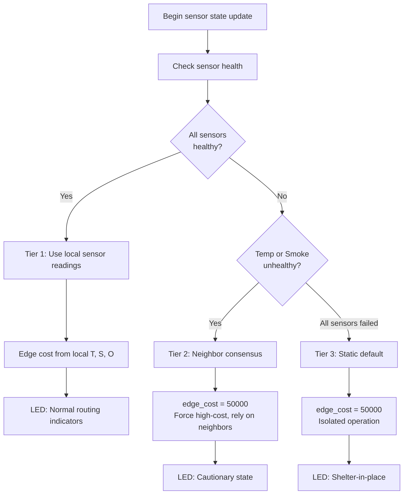

# SafeRouteAI Firmware Documentation

## Architecture Overview

The firmware implements a decentralized link-state routing protocol for real-time fire evacuation. Each ESP32 node independently reads local sensors, fuses the data into continuous exponential edge costs, floods its link-state via ESP-NOW broadcast, and runs a full Dijkstra computation over a double-buffered link-state table to determine the safest evacuation path. No central controller is required for routing decisions.



## FreeRTOS Task Layout

The firmware runs on the ESP32 dual-core architecture. The main loop runs on Core 0 (Arduino `loop()`), and a dedicated LED animation task is pinned to Core 1.

### Main Loop Task (Core 0)

The Arduino `loop()` function executes on Core 0 as a FreeRTOS task automatically created by the Arduino framework. It runs at the default priority (1) and handles all non-visual operations in sequence:

1. Sensor read → dual-path conditioning → EWMA update
2. Hazard computation (exponential edge cost)
3. Link-state table upsert of own entry
4. ESP-NOW broadcast flood (on trigger or refresh interval)
5. Link-state aging of stale entries
6. Dijkstra shortest-path computation
7. Hold-down hysteresis check
8. LED command decision

### LED Animation Task (Core 1)

Created explicitly in `setup()`:

```c
xTaskCreatePinnedToCore(leds_task, "leds", 4096, NULL, 1, NULL, 1);
```

- **Core:** 1 (PRO_CPU)
- **Priority:** 1
- **Stack:** 4096 bytes
- **Purpose:** Drives WS2812B LED animations independently of the main loop, ensuring smooth visual guidance even during pathfinding computation.

The task runs an infinite loop at 20 Hz (50 ms `delay()`) and renders:

- **Green chase:** Moving window along the strip in the direction of the next hop
- **Yellow chase:** Same pattern with yellow base
- **Red pulse:** Sinusoidal brightness modulation of entire strip
- **White strobe:** 250 ms on/off square wave

### MQTT Gateway Task (No Dedicated Task)

The gateway runs **inline** within the main loop and the ESP-NOW receive callback. MQTT operations do not get a dedicated task because:

1. The gateway best-effort publishes only — it is never on the routing decision path
2. The ESP-NOW callback enqueues publishes directly
3. WiFi connectivity is checked before every publish (`WiFi.isConnected()`)

If WiFi/MQTT is unavailable, the node continues routing independently without degradation.

## Task Scheduling and Priorities

| Task | Core | Priority | Stack | Rate | Notes |
|------|------|----------|-------|------|-------|
| Arduino `loop()` | 0 | 1 (default) | 8-16 KB (Arduino default) | ~20 Hz (50 ms delay) | Main control loop |
| LED animation | 1 | 1 | 4096 bytes | 20 Hz | Dedicated visual output |
| ESP-NOW receive callback | 0 | ISR context | N/A | Event-driven | Triggered by wireless frame |
| MQTT keepalive | 0 | 1 | Inline | Inline | No dedicated task |

## Callback Architecture (ESP-NOW Receive)

The ESP-NOW receive handler is registered in `comms_init()`:

```c
esp_now_register_recv_cb(on_data_recv);
```

The callback chain:



The `on_packet_received` function in `main.cpp`:

1. Selects the inactive write buffer (opposite of `active_table`)
2. Validates sequence number via `seq_num_accept()`
3. Upserts the incoming link-state entry
4. Atomically swaps the `active_table` pointer
5. Sets `table_updated = true` to trigger a routing recomputation in the main loop

## ISR Usage and Sensor Sampling Timing

The ESP-NOW receive callback (`on_data_recv`) runs in ISR-like context (ESP-NOW callback context, not a full task). The firmware follows these ISR design rules:

1. **Minimal work in ISR:** The callback copies the packet, validates CRC16, and swaps the buffer pointer — no heap operations, no blocking calls
2. **No sensor sampling in ISR:** DHT22 temperature reads require ~250 ms timing, MQ-2 ADC reads take ~50 µs — these are done in the main loop only
3. **DHT22 timing constraint:** The DHT22 requires a minimum 2-second interval between reads; the main loop's 50 ms delay naturally allows this with a counter or millis() gating (currently reads every loop cycle — on real hardware this would exceed the DHT22's max rate, prompting a read gating mechanism)
4. **ADC reads:** `adc1_get_raw()` is called from the main loop; it takes ~40-80 µs per sample

## Routing Algorithm Detail (Dijkstra over Link-State Table)

### Algorithm

The `routing_compute()` function implements a classic Dijkstra shortest-path algorithm with the following characteristics:

- **Graph size:** Up to 15 nodes, 40 edges (bounded by `MAX_NODES`, `MAX_EDGES`)
- **Data structure:** Flat array-based priority queue (O(V²) complexity — acceptable for V ≤ 15)
- **Search:** Finds minimum-cost path from own node to the nearest exit node

```pseudocode
function routing_compute(own_id, table, graph):
    for each node in graph:
        dist[node] = INFINITY
        visited[node] = false
        prev[node] = 0

    dist[own_node] = 0

    for iteration in 0..node_count:
        u = unvisited node with minimum dist[u]
        if u is null: break
        visited[u] = true

        for each neighbor v of u:
            if visited[v]: continue

            // Retrieve link-state data for v
            if v has flame_detected:
                dist[v] = dist[u] + BLOCK_MULTIPLIER * base_distance
                prev[v] = u
                continue

            // Normal edge weight computation
            edge_cost = compute_edge_cost(T_norm, S_norm, O_norm,
                                         base_distance, flame, capacity)
            new_dist = dist[u] + edge_cost
            if new_dist < dist[v]:
                dist[v] = new_dist
                prev[v] = u

    // Find nearest exit node
    nearest_exit = argmin(dist[exit_nodes])
    if dist[nearest_exit] >= SHELTER_THRESHOLD:
        return SHELTER_IN_PLACE

    // Backtrack to find next hop
    walk = nearest_exit
    while prev[walk] != own_id:
        walk = prev[walk]
    return next_hop = walk
```

### Edge Cost Function

```c
float compute_edge_cost(float T_norm, float S_norm, float O_norm,
                         float base_dist, bool flame, float cap)
```

`cost = base_dist * exp(2.2 * T_norm + 1.6 * S_norm) + 0.5 * O_norm * base_dist`

Where:
- `T_norm` = clamped `(current_temp - T_baseline) / (T_critical - T_baseline)` in [0,1]
- `S_norm` = clamped `(current_smoke - S_baseline) / (S_critical - S_baseline)` in [0,1]
- `O_norm` = clamped `(edge_cost / occupant_capacity)` in [0,1]
- If `flame == true`: `cost *= BLOCK_MULTIPLIER` (1,000,000×)

The exponential formulation ensures:
- **No binary thresholds:** Cost increases continuously with hazard
- **Flashover sensitivity:** The `exp(2.2 * T_norm + 1.6 * S_norm)` factor amplifies when both temperature and smoke rise simultaneously
- **Flame blocking:** A detected flame multiplies cost by 1,000,000, essentially blocking that edge — Dijkstra will route around it unless all paths are blocked (→ shelter-in-place)

## Sensor Processing Pipeline



### DHT22 Temperature Read

```c
float sensor_read_temperature(void) {
    float t = dht.readTemperature();
    if (isnan(t)) return 25.0f;  // graceful default on read failure
    return t;
}
```

- Protocol: Single-wire, ~250 ms read cycle
- Range: -40°C to 80°C
- Accuracy: ±0.5°C
- Resolution: 0.1°C
- Sampling: Called every main loop iteration (~50 ms interval), but DHT22 hardware limits read rate to ≤1 Hz

### MQ-2 Smoke ADC Read

```c
float sensor_read_smoke(void) {
    int raw = adc1_get_raw(MQ2_ADC_CHANNEL);
    float voltage = raw * (3.3f / 4095.0f);
    float ratio = voltage / 3.3f;
    float ppm = 1000.0f * (1.0f - ratio);
    if (ppm < 0) ppm = 0;
    return ppm;
}
```

- ADC: 12-bit (0-4095), ADC1_CHANNEL_0 (GPIO36)
- Attenuation: 11 dB (0-3.3V input range)
- Conversion: ~40-80 µs per `adc1_get_raw()` call
- The linear mapping `ppm = 1000 * (1 - ratio)` is a simplified approximation; real MQ-2 response is logarithmic and temperature-dependent

### IR Flame Digital Read

```c
bool sensor_read_flame(void) {
    int raw = adc1_get_raw(FLAME_ADC_CHANNEL);
    return raw < 500;  // threshold at ~0.4V
}
```

- ADC channel: ADC1_CHANNEL_3 (GPIO39)
- Wavelength range: 760-1100 nm (IR spectrum)
- Logic: Raw ADC < 500 → flame detected
- Sampling: Called every main loop iteration

### Dual-Path Conditioning (EWMA + Rate Trigger)

The `DualPathFilter` provides two parallel detection paths:

**Path 1: EWMA (Slow, Noise-Rejecting)**

`ewma = alpha * raw_sample + (1 - alpha) * ewma`

- `alpha = 0.3` (moderate smoothing)
- Trigger: `|ewma - old_ewma| >= delta_threshold`
- Thresholds: temperature delta_th = 2.0°C, smoke delta_th = 10.0 PPM

**Path 2: Rate-of-Change (Fast, Transient-Responsive)**

- `rate = raw_sample - prev_raw`
- Trigger: `|rate| >= rate_threshold` for 2 consecutive samples
- Thresholds: temperature rate_th = 5.0°C/s, smoke rate_th = 50.0 PPM/s
- 2-sample debounce prevents single-sample noise spikes from triggering false alarms

**Both paths share a single filter instance.** The `dual_path_update()` returns `true` if either path triggers.

## LED Controller States

The LED animation task reads the `LedCommand` struct (written by the main loop) and renders the corresponding animation.



| Color | Animation | Brightness | Meaning | Trigger Condition |
|-------|-----------|------------|---------|-------------------|
| **Green** | Chase (moving window, direction = next hop) | 64 | Safe path, proceed to exit | `choose_led_state()` returns `LED_GREEN` |
| **Yellow** | Chase (same pattern, yellow base) | 96 | Alternate route via high-smoke area | `rerouted_from_original` AND `S_norm > T_norm` |
| **Red** | Pulse (sinusoidal brightness, all LEDs) | 128-255 | Immediate danger — avoid area | `flame_detected_on_current` OR `flame_detected_on_next` |
| **White** | Strobe (250 ms on/off, full brightness) | 255 | Shelter-in-place — do not move | `shelter_in_place == true` |

The direction of the chase animation indicates the evacuation direction (toward the next hop). Pulse rate maps to `cost_to_exit / 50000.0` (higher cost = faster pulse).

## Packet Format and Flooding Mechanism

### HazardPacket Layout

```c
typedef struct __attribute__((packed)) {
    uint16_t node_id;        // 2 bytes  - Source node identifier (1-15)
    uint32_t seq_num;        // 4 bytes  - Monotonic sequence number
    uint32_t node_uptime_ms; // 4 bytes  - Node uptime at transmission
    float    temp_c;         // 4 bytes  - Temperature in Celsius
    float    smoke_ppm;      // 4 bytes  - Smoke concentration in PPM
    bool     flame_detected; // 1 byte   - IR flame sensor flag
    float    edge_cost;      // 4 bytes  - Computed edge cost from this node
    uint8_t  ttl;            // 1 byte   - Time-to-live (decremented each hop)
    uint16_t crc16;          // 2 bytes  - CRC-16/Modbus checksum
} HazardPacket;              // TOTAL: 26 bytes
```

Total packet size is 26 bytes — well within the ESP-NOW maximum payload of 250 bytes.

### Flooding Mechanism



Key properties:

1. **ESP-NOW broadcast:** Each transmit goes to `0xFF:FF:FF:FF:FF:FF` (all peers on channel)
2. **Sequence number anti-replay:** `seq_num_accept()` uses RFC 1982 serial number arithmetic:
   - Accepts only strictly increasing sequence numbers per source node
   - Duplicates are silently dropped (prevents broadcast storms and replay attacks)
   - Safe gap: < 2³¹ between packets from same source (~136 years at 1 pkt/s)
3. **TTL decay:** Each hop decrements TTL; TTL=0 packets are not forwarded
4. **CRC16 validation:** CRC-16/Modbus over all bytes except the CRC field itself
5. **Double-buffered write:** Incoming packets update the inactive buffer, then the active pointer is atomically swapped

## Double-Buffered Link-State Table (Lock-Free, Atomic Pointer Swap)



The double-buffered design eliminates the need for mutexes:

```c
static LinkStateTable link_state_buffer_a;
static LinkStateTable link_state_buffer_b;
static volatile LinkStateTable *active_table = NULL;
```

**Write path (ESP-NOW callback):**

```c
if (active_table == &link_state_buffer_a) {
    write_buf = &link_state_buffer_b;
} else {
    write_buf = &link_state_buffer_a;
}
link_state_upsert(write_buf, ...);
active_table = write_buf;  // atomic pointer swap on 32-bit aligned pointer
table_updated = true;
```

**Read path (main loop):**

```c
DijkstraResult dijk = routing_compute(MY_NODE_ID, active_table, &building_graph);
```

The main loop reads `active_table` and the callback writes to the opposite buffer, then swaps the pointer. The swap of a `volatile` 32-bit pointer on ESP32 is naturally atomic (word-aligned write on Xtensa LX6). The `table_updated` flag signals the main loop to recompute routing.

**Note:** The write buffer is shared between the callback and the main loop (which also upserts its own entry). On current hardware, this is safe because the main loop is the only writer of the own-node entry and the callback is the only writer of remote entries. A full protocol would need a spinlock if both could write to arbitrary entries concurrently.

## Hold-Down Hysteresis (1800 ms Anti-Flicker)

Route oscillation is prevented by the `hold_down_should_switch()` function:

```c
bool hold_down_should_switch(uint16_t new_next_hop, uint16_t current_next_hop,
                              float new_cost, bool flame_on_current_edge,
                              uint32_t now_ms) {
```

**Logic:**

| Condition | Decision |
|-----------|----------|
| `new_next_hop == 0` | Reject (no route) |
| `current_next_hop == 0` | Accept (initial path) |
| `flame_on_current_edge` | Accept immediately (emergency escape) |
| `!initial_path_set` | Accept (first valid path) |
| `elapsed < HOLD_DOWN_MS` AND `new_cost > 0.7 * SHELTER_THRESHOLD` | **Reject** — prevent oscillation during near-shelter conditions |
| Otherwise | Accept |

The hold-down timer resets on each accepted switch. The threshold condition `new_cost > 0.7 * SHELTER_THRESHOLD` means the filter activates only when the system is near shelter-in-place conditions (cost > 70,000), preventing route ping-pong when both alternatives are similarly dangerous.

## Three-Tier Fail-Safe Hierarchy



### Sensor Health Detection

Each sensor (temperature, smoke, flame) has a `SensorHealth` tracker that maintains:

1. **10-sample ring buffer** of recent readings
2. **5-second stuck window** (`SENSOR_STUCK_WINDOW_MS = 5000`)
3. **Variance floor** (`SENSOR_NOISE_FLOOR = 0.001`)

A sensor is marked **unhealthy** if:
- Any sample is `NaN`, or
- Any sample is outside `[phys_min, phys_max]` range, or
- Variance of 10 samples over 5 seconds is below the noise floor (sensor is stuck/flatlined)

### Failover Tiers

| Tier | Condition | Edge Cost Used | Data Source |
|------|-----------|----------------|-------------|
| **Tier 1** | All sensors healthy | `compute_edge_cost(T_norm, S_norm, O_norm, ...)` | Local DHT22, MQ-2, IR |
| **Tier 2** | Temperature or smoke failed | 50,000 (high cost) + neighbor consensus via link-state | Peers' advertised costs |
| **Tier 3** | Isolated/catastrophic failure | 50,000 (high cost) | Static default, no local sensing |

## Link-State Aging (6000 ms Timeout)

Stale entries in the link-state table are decayed rather than immediately removed:

```c
void link_state_age_edges(LinkStateTable *tbl, uint32_t now_ms, uint16_t own_id)
```

**Aging rule:**

- Entries with `now_ms - last_update_ms > STALE_TIMEOUT_MS` (6000 ms) are considered stale
- Edge cost is linearly decayed over a 60-second ramp:
  `decayed_cost = base_cost * (1.0 + age_ratio * 10.0)`
  where `age_ratio = clamp((elapsed - 6000) / 60000, 0, 1)`
- After 66 seconds without updates, the cost has decayed to 11× the base cost
- The own-node entry is never aged out
- `flame_detected` is **never set** by the aging logic — high cost and flame are distinct signals

## Build Instructions

### Prerequisites

- [PlatformIO Core](https://platformio.org/install) (CLI or VS Code extension)
- ESP32 development board (or Wokwi simulation for testing)

### Build

```bash
# Build firmware binary
pio run --environment esp32dev

# Build with test flags
pio run --environment test
```

### Upload

```bash
pio run --target upload --environment esp32dev
```

### Monitor

```bash
pio device monitor
# Baud rate: 115200
```

### Simulation Mode

The firmware includes a simulation mode that activates when `REAL_HARDWARE` is not defined (the default). In simulation:

- Temperature oscillates sinusoidally around 25°C (±2°C)
- At 15 seconds simulated time, temperature jumps +15°C and smoke rises to 200-300 PPM
- All sensor read functions return dummy values

To build for real hardware, add `-DREAL_HARDWARE` to `build_flags` in `platformio.ini`.

## Timing Budget Table

| Operation | Approximate Time | Frequency | Total per Cycle |
|-----------|-----------------|-----------|-----------------|
| DHT22 read | ~250 ms (blocking) | ~1 Hz (gated) | ~250 ms |
| MQ-2 ADC read | ~80 µs | Every cycle | ~80 µs |
| IR flame ADC read | ~80 µs | Every cycle | ~80 µs |
| Dual-path update (2 filters) | ~10 µs | Every cycle | ~10 µs |
| Link-state upsert | ~5 µs | Every cycle | ~5 µs |
| Link-state age edges | ~30 µs | Every cycle | ~30 µs |
| Dijkstra (15 nodes) | ~200-500 µs | On trigger/refresh | ~500 µs |
| Hold-down check | ~5 µs | Every cycle | ~5 µs |
| LED command decision | ~10 µs | Every cycle | ~10 µs |
| ESP-NOW broadcast | ~2-10 ms (air time) | Every 2 s (refresh) | N/A |
| Serial printf | ~5-20 ms | Every cycle | ~20 ms |

**Total per main loop cycle:** ~250 ms (dominated by DHT22 read time). The 50 ms `delay()` in `loop()` provides consistent pacing. On real hardware, a DHT read gating mechanism must be added to respect the DHT22's 2-second minimum interval.

## Memory Usage Considerations

### Static RAM Allocation

| Section | Size | Details |
|---------|------|---------|
| LED frame buffer | 90 bytes | 30 LEDs × 3 bytes (CRGB) |
| LinkStateTable A | ~660 bytes | 15 entries × 44 bytes |
| LinkStateTable B | ~660 bytes | Double buffer copy |
| BuildingGraph | ~1660 bytes | 15 nodes + 40 edges |
| FastLED internal | ~100 bytes | Bookkeeping for WS2812B |
| Stack (LED task) | 4096 bytes | Dedicated FreeRTOS stack |
| Total estimated | ~7266 bytes | Out of 520 KB SRAM available |

### Heap Usage

The firmware uses minimal dynamic allocation after `setup()`:

- **PubSubClient** allocates internal MQTT send/receive buffers (~512 bytes)
- **WiFi** stack allocates ~40 KB for TCP/IP
- No `malloc`/`new` in the main loop or callback paths

### SRAM Constraints (ESP32)

| Resource | Capacity | Firmware Usage | Headroom |
|----------|----------|----------------|----------|
| SRAM | 520 KB | ~50-60 KB (estimated) | ~460 KB |
| IRAM | 128 KB | ~20-25 KB | ~100 KB |
| Flash (code) | 4 MB | ~200-300 KB | ~3.7 MB |

The firmware has substantial headroom for additional features, sensor fusion complexity, or larger buildings (up to ~50+ nodes before the O(V²) Dijkstra becomes a timing concern).

## Component Files

### Source Files (`firmware/src/`)

| File | Lines | Description |
|------|-------|-------------|
| `main.cpp` | 240 | System setup, control loop orchestration, sensor read/route/act cycle |
| `sensor_drivers.cpp` | 37 | Physical sensor sampling (DHT22, MQ-2 ADC, IR flame ADC) |
| `fusion.cpp` | 93 | Dual-path conditioning (EWMA + rate trigger), sensor health detection |
| `routing.cpp` | 229 | Dijkstra path planner, edge cost formula, hold-down hysteresis, LED state selector |
| `leds.cpp` | 83 | FreeRTOS LED animation task, chase/pulse/strobe renderers |
| `comms.cpp` | 84 | ESP-NOW initialization, peer management, broadcast send, receive callback |
| `link_state.cpp` | 53 | Link-state table management (init, find, upsert, age) |
| `failsafe.cpp` | 37 | Three-tier sensor health monitor and failover logic |
| `gateway.cpp` | 76 | WiFi/MQTT gateway for read-only telemetry publishing |
| `HazardPacket.cpp` | 22 | CRC-16/Modbus calculation and validation |

### Header Files (`firmware/include/`)

| File | Description |
|------|-------------|
| `sensor_drivers.h` | Pin definitions (DHT_PIN=GPIO4, MQ2=ADC1_CH0, FLAME=ADC1_CH3), sensor read API |
| `fusion.h` | `DualPathFilter` and `SensorHealth` structure definitions, filtering API |
| `routing.h` | `DijkstraResult`, `EdgeDecision`, `LedColor` enums, routing API |
| `leds.h` | `LedCommand` structure, `NUM_LEDS=30`, LED task declaration |
| `comms.h` | ESP-NOW channel config, `comms_recv_cb_t` callback type, sequence number API |
| `link_state.h` | `LinkStateEntry` and `LinkStateTable` structures, `MAX_NODES=15`, `STALE_TIMEOUT_MS=6000` |
| `graph_topology.h` | `NodeConfig`, `EdgeConfig`, `BuildingGraph`, `AdjacencyList` structures |
| `failsafe.h` | `FailoverTier` enum (`TIER_1_LOCAL_SENSOR`, `TIER_2_NEIGHBOR_CONSENSUS`, `TIER_3_STATIC_DEFAULT`) |
| `gateway.h` | MQTT gateway publish API (hazard and status) |
| `HazardPacket.h` | Wire packet layout (26 bytes packed), CRC16 validation, `DEFAULT_TTL=4` |
