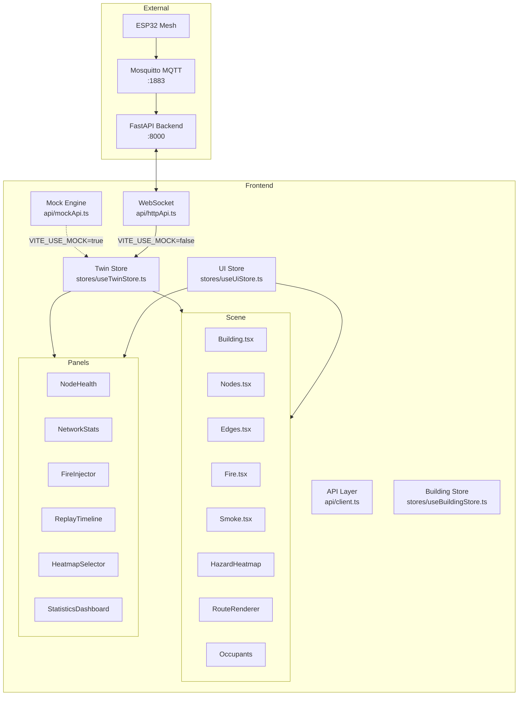

# SafeRouteAI — Frontend

## Technology Stack

| Layer | Library | Version |
|---|---|---|
| Framework | React | 19 |
| Language | TypeScript | 5.8 |
| Bundler | Vite | 8 |
| Routing | TanStack Router | 1.170 |
| 3D Rendering | @react-three/fiber (R3F) | 9.6 |
| 3D Helpers | @react-three/drei | 10.7 |
| Three.js | three | 0.185 |
| CSS | Tailwind CSS | 4.2 |
| State (global) | Zustand | 5.0 |
| Server state | TanStack React Query | 5.101 |
| Charts | Recharts | 2.15 |
| Animation | Framer Motion | 12 |
| Icons | Lucide React | 0.575 |
| Forms | React Hook Form + Zod | 7.71 / 3.24 |
| UI Kit | Radix UI (30+ primitives) | latest |
| Toasts | Sonner | 2.0 |

---

## Architecture Overview



---

## Directory Structure

```
frontend/src/
  api/              # Backend API abstraction
    client.ts       # Api selector: mockApi ↔ httpApi
    httpApi.ts      # HTTP + WebSocket client for FastAPI
    mockApi.ts      # Standalone mock engine (no backend needed)
    types.ts        # Shared TypeScript types matching backend models
  assets/
    buildings/      # JSON building definitions (index.json + per-building dirs)
  components/
    buildings/      # BuildingCard.tsx (library UI)
    common/         # Shared UI primitives
    layout/         # App shell layout
    panels/         # Side panels
      FireInjector.tsx, HeatmapSelector.tsx, NetworkStats.tsx,
      NodeHealth.tsx, NodeInspector.tsx, OccupantConfig.tsx,
      ReplayTimeline.tsx, ShortcutsHelp.tsx, StatisticsDashboard.tsx,
      StatusBanner.tsx
    scene/          # 3D scene components (R3F)
      Scene.tsx, Building.tsx, Nodes.tsx, Edges.tsx, Fire.tsx,
      Smoke.tsx, HazardHeatmap.tsx, RouteRenderer.tsx, Occupants.tsx,
      CameraRig.tsx, Fallback2DView.tsx, A11ySceneSummary.tsx,
      SceneErrorBoundary.tsx
    ui/             # Generic UI components
  hooks/            # Custom React hooks
  lib/              # Utilities
    hazard.ts       # Hazard-to-RGB conversion
    utils.ts        # General helpers
    error-capture.ts, error-page.ts
  scene/            # Three.js orchestration (non-React)
    SceneManager.ts # Core renderer, camera, animation loop
    AssetManager.ts # 3D asset loading
    GraphRenderer.ts# Low-level graph mesh building
    FireSimulation.ts, SmokeSimulation.ts
    LightingManager.ts, CoordinateSystem.ts
    heights.ts      # Y-offset constants
  services/
    buildingService.ts  # Building definition loader
  simulation/       # Mock engine (TypeScript)
    engine.ts       # SimState, hazard diffusion, Dijkstra, tick
    nodePlacer.ts   # Converts BuildingDef → BuildingGraph
  stores/
    useTwinStore.ts # Digital twin state (graph + snapshot + history)
    useUiStore.ts   # UI state (panels, filters, view mode)
    useBuildingStore.ts # Building metadata list
  routes/           # TanStack Router route definitions
  router.tsx        # Router creation
  styles.css        # Global styles
  server.ts         # SSR entry (error wrapper)
  start.ts          # App bootstrap
```

---

## Component Hierarchy

### Scene (3D Canvas — R3F)

The 3D scene lives inside `<Canvas>` with `OrbitControls` and layered components:

```
<Scene>
  <Canvas>
    <color />            ← Dark background (#0a0e14)
    <fog />              ← Distance fog
    <SceneLighting />    ← hemisphere + ambient + 3x directional
    <Suspense>
      <Building />       ← Floor slabs, room outlines, borders
      <HazardHeatmap />  ← Per-floor hazard color overlay
      <Edges />          ← Graph edge lines
      <RouteRenderer />  ← Animated evacuation route arrows (InstancedMesh)
      <Nodes />          ← Sensor node spheres (InstancedMesh, color states)
      <Occupants />      ← Occupant indicator dots
      <Fire />           ← Flame particles + flickering point lights
      <Smoke />          ← Rising semi-transparent smoke puffs
    </Suspense>
    <InjectionOverlay /> ← Double-click to inject fire (when tool active)
    <CameraRig />        ← Camera animation (top-down / focus fire)
    <OrbitControls />    ← User interaction
  </Canvas>
</Scene>
```

#### Building Component (`Building.tsx`)

Renders each floor as a semi-transparent slab with a border outline. Room rectangles are drawn as `LineSegments` from `EdgesGeometry`. Floors not matching the active floor filter are dimmed.

#### Node Component (`Nodes.tsx`)

Uses R3F `<Instances>` for GPU-instanced sphere rendering. Each `NodeInstance` subscribes to the Zustand store via `subscribe()` (not re-render) and mutates its `color` and `scale` directly per frame:

| Condition | Color | Behavior |
|---|---|---|
| Normal / online | Cyan (#22d3ee) | Default scale |
| Exit node | Green (#7dff9f) | Larger base scale |
| Stale / offline | Gray (#a0aec0) | Dimmed |
| Flame / smoke > 0.5 | Orange (#ff6a3d) | Pulsing scale |
| Selected | White (#ffffff) | Pulsing glow |

#### Fire Effect System (`Fire.tsx`)

Each active fire node spawns a `<FlameAt>` group with:
- **Particle system**: 40 points per fire, `AdditiveBlending`, color `#ff9040`. Each particle has velocity + lifetime and is recycled on death.
- **Flicker light**: `PointLight` with intensity modulated by `sin(performance.now()) + random()`.

#### Smoke Effect System (`Smoke.tsx`)

60 reusable sphere meshes that rise and fade. Smoke spawns at nodes whose `smoke > 0.15`. Each puff has opacity decay + random horizontal drift.

#### Evacuation Route Rendering (`RouteRenderer.tsx`)

Routes are rendered as `InstancedMesh` dot arrays along `CatmullRomCurve3` paths. Each route has a color based on priority, and the dots pulse with a traveling sine wave to show direction.

| Priority Range | Color | Pulse Speed |
|---|---|---|
| ≥ 0.9 | Green | Slow |
| ≥ 0.7 (with stairwell) | Purple | Medium |
| ≥ 0.7 | Blue | Medium |
| ≥ 0.5 | Amber | Medium |
| ≥ 0.3 | Orange | Fast |
| < 0.3 | Red | Fast |
| Exit tips | Cyan | Slow |

#### Heatmap Overlay (`HazardHeatmap.tsx`)

Each floor has a `DataTexture` populated from `snapshot.hazard[floorIndex]` values mapped through mode-specific color functions. Modes: `hazard`, `temperature`, `smoke`, `occupancy`, `network`. Updated on every snapshot tick.

### Side Panels

| Panel | File | Shows |
|---|---|---|
| Node Health | `panels/NodeHealth.tsx` | Selected node's temperature, smoke, CO, flame, occupants, failover tier |
| Network Stats | `panels/NetworkStats.tsx` | Packet count, CRC failures, stale nodes, latency, WebSocket status |
| Fire Injector | `panels/FireInjector.tsx` | Scenario selector + node picker to trigger events |
| Replay Timeline | `panels/ReplayTimeline.tsx` | Scrub through history buffer (max 600 snapshots) |
| Heatmap Selector | `panels/HeatmapSelector.tsx` | Choose heatmap visualization mode |
| Statistics Dashboard | `panels/StatisticsDashboard.tsx` | Aggregate charts over time |
| Status Banner | `panels/StatusBanner.tsx` | System status (NORMAL → NO_SAFE_EXIT) |
| Node Inspector | `panels/NodeInspector.tsx` | Click a node to inspect its state |

---

## Stores

### useTwinStore (`stores/useTwinStore.ts`)

Single source of truth for the digital twin. Uses `subscribeWithSelector` middleware so scene components can subscribe without re-rendering.

```typescript
interface TwinStore {
  graph: BuildingGraph | null;        // Active building topology
  loading: boolean;
  error: string | null;
  activeBuildingId: string | null;
  live: boolean;                       // Live mode vs replay
  snapshot: Snapshot | null;           // Latest snapshot
  history: Snapshot[];                 // Rolling buffer (max 600)
  replayIndex: number;
  selectedNodeId: string | null;
  cameraMode: "perspective" | "top";
  focusFireAt: number;                 // Timestamp trigger for camera zoom

  load(buildingId?: string): Promise<void>;
  setActiveBuilding(buildingId: string): Promise<void>;
  select(id: string | null): void;
  setCameraMode(m): void;
  focusFire(): void;
  setLive(v: boolean): void;
  setReplayIndex(i: number): void;
  ingest(s: Snapshot): void;           // Called by WebSocket/mock on each tick
}
```

### useUiStore (`stores/useUiStore.ts`)

UI-only state that does not belong in the twin:

```typescript
interface UiStore {
  leftOpen: boolean;                    // Left panel
  rightOpen: boolean;                   // Right panel
  helpOpen: boolean;
  activeFloor: number | "all";          // Floor filter
  heatmapMode: HeatmapMode;
  injectionToolActive: boolean;
  occupantCount: number;
  viewMode: "auto" | "2d" | "3d";
}
```

### useBuildingStore (`stores/useBuildingStore.ts`)

Building metadata list loaded from `assets/buildings/index.json`.

---

## API Layer

The API layer (`api/client.ts`) selects between mock and HTTP backends based on `VITE_USE_MOCK`:

### SafeRouteApi Interface (`api/types.ts`)

```typescript
interface SafeRouteApi {
  getAvailableBuildings?(): Promise<BuildingMeta[]>;
  getGraph(buildingId?: string): Promise<BuildingGraph>;
  subscribeSnapshots(cb, buildingId?): Unsubscribe;
  inject(req: InjectRequest, buildingId?): Promise<void>;
  reset(buildingId?): Promise<void>;
  runDemo(buildingId?): Promise<void>;
  getReplay(range: TimeRange, buildingId?): Promise<Snapshot[]>;
}
```

### Mock Client (`api/mockApi.ts`)

- Runs a TypeScript simulation engine identical in logic to the backend's Python `engine.py`
- Uses `@/simulation/engine.ts` — same Dijkstra, same cost formula, same constants (`ALPHA=2.2`, `BETA=1.6`, `GAMMA=0.5`)
- Delivers snapshots every 200ms via `setInterval`
- Supports demo sequence: staged fire escalation over 40 seconds

### HTTP Client (`api/httpApi.ts`)

- `GET /api/graph` — fetch building topology
- `WebSocket /api/events` — subscribe to real-time snapshot stream (auto-reconnects with 2s backoff)
- `POST /api/inject` — trigger hazard scenarios
- `POST /api/reset` — clear all events
- `POST /api/demo` — run backend auto-demo
- `GET /api/replay` — fetch historical range
- `GET /api/buildings` — list available buildings

---

## Rendering Pipeline

```
WebSocket / mock setInterval
        │
        ▼  (200ms tick)
  Zustand useTwinStore.ingest(snapshot)
        │
        ├──► UI panels re-render (via hook + selector)
        │
        └──► Scene components (via subscribe() callbacks)
                │
                ├── Building.tsx      ← reads graph.floors
                ├── Nodes.tsx         ← reads snapshot.nodes[id]
                ├── Edges.tsx         ← reads graph.edges
                ├── RouteRenderer.tsx ← reads snapshot.routes
                ├── HazardHeatmap.tsx ← reads snapshot.hazard[floor]
                ├── Fire.tsx          ← reads snapshot.activeFireNodes
                ├── Smoke.tsx         ← reads snapshot.nodes[id].smoke
                └── Occupants.tsx     ← reads snapshot.nodes[id].occupants
```

Scene components use `useTwinStore.subscribe(selector, callback)` to avoid per-frame React re-renders. The callback mutates Three.js Object3D refs directly.

---

## Mock Mode vs Live Mode

| Feature | Mock Mode (`VITE_USE_MOCK=true`) | Live Mode (`VITE_USE_MOCK=false`) |
|---|---|---|
| Backend required | No | Yes (FastAPI + Mosquitto) |
| Simulation engine | TypeScript (`src/simulation/engine.ts`) | Python (`backend/engine.py`) |
| Data source | `setInterval` tick | WebSocket from FastAPI |
| ESP32 hardware | Not needed | Full sensor mesh |
| Demo mode | Built-in 40s staged sequence | POST /api/demo |

The API client uses automatic fallback: if the HTTP backend is unreachable and `VITE_USE_MOCK` is not forced to `false`, it falls through to the mock engine.

---

## Three.js Scene Setup

Managed in `src/scene/SceneManager.ts`:

| Property | Value |
|---|---|
| Background | `0x0a0e14` (dark blue-gray) |
| Fog | `Fog(0x0a0e14, 120, 300)` |
| Camera | `PerspectiveCamera(50, aspect, 0.1, 500)` |
| Initial position | `(50, 40, 60)` |
| Pixel ratio | `min(devicePixelRatio, 2)` |
| Shadows | `PCFSoftShadowMap` |
| Tone mapping | `ACESFilmicToneMapping`, exposure 1.2 |
| Color space | `SRGBColorSpace` |

Lighting: hemisphere + ambient + 3 directional lights with shadow support.

---

## Building Asset Loading

Building definitions are stored as JSON in `frontend/src/assets/buildings/`:

```
assets/buildings/
  index.json            ← List of BuildingMeta
  mega-mall/
    building.json       ← BuildingDef (rooms, corridors, floors)
  hospital/
    building.json
  office/
    building.json
```

Each building JSON follows the `BuildingDef` schema: rooms with positions/dimensions, corridors with junction points, and floor metadata. The `nodePlacer.ts` service converts this into a `BuildingGraph` (nodes + edges + floor plans) by placing sensor nodes at room centers and creating edges from corridor definitions, including vertical stairwell connections.

## Building Generation from Graph Topology

The `nodePlacer` algorithm (`src/simulation/nodePlacer.ts`, mirrored in `backend/node_placer.py`):

1. Place sensor nodes at room centroids (exits get kind `exit`, stairwells get `stairwell`)
2. Insert junction nodes at corridor waypoints
3. Connect room nodes to junctions via edges
4. Connect stairwell rooms vertically across floors
5. Center the building at origin
6. Build floor plan metadata for the rendering layer
