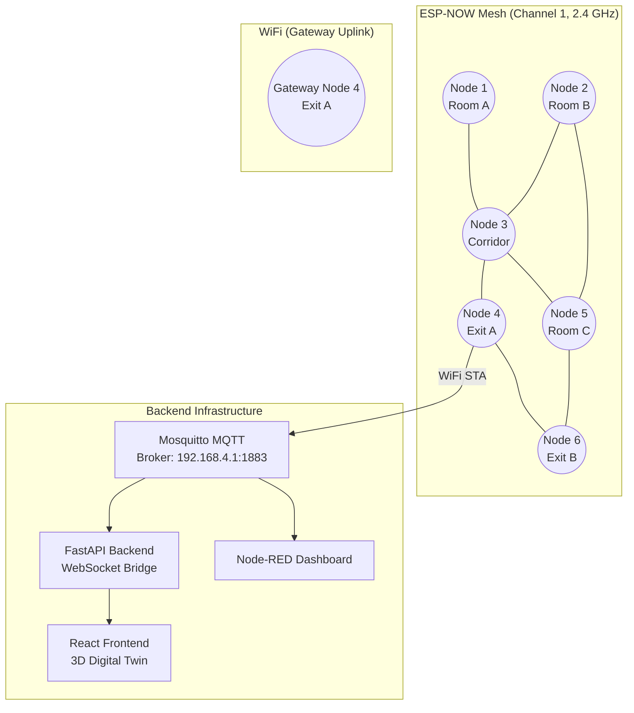

# SafeRouteAI Hardware Documentation

## Component List

### ESP32 Development Board (ESP32-DevKitC / ESP-WROOM-32)

| Parameter | Value |
|-----------|-------|
| Microcontroller | Xtensa LX6 dual-core 32-bit |
| Clock Speed | 240 MHz |
| SRAM | 520 KB |
| Flash | 4 MB |
| WiFi | 802.11 b/g/n (2.4 GHz) |
| Bluetooth | BLE 4.2 + Classic |
| GPIO | 34 programmable pins |
| ADC | 2 × 12-bit SAR ADCs (18 channels total) |
| Operating Voltage | 3.3 V |
| Input Voltage (VIN) | 5-12 V (via USB or VIN pin) |
| Deep Sleep Current | ~5 µA |
| Active Current (WiFi TX) | ~80 mA (average) |
| Cost (retail) | $5-8 |

### DHT22 Temperature & Humidity Sensor

| Parameter | Value |
|-----------|-------|
| Temperature Range | -40°C to +80°C |
| Temperature Accuracy | ±0.5°C |
| Temperature Resolution | 0.1°C |
| Humidity Range | 0-100% RH |
| Humidity Accuracy | ±2% RH |
| Humidity Resolution | 0.1% RH |
| Interface | Single-wire digital (OneWire protocol) |
| Sampling Rate | ≤1 Hz (minimum 2 s interval) |
| Supply Voltage | 3.3-5.5 V |
| Supply Current | ~1.5 mA (idle), ~2.5 mA (measuring) |
| Dimensions | 27 × 59 × 13.5 mm |
| Operating Range | -40°C to +80°C (temperature), 0-100% RH (humidity) |
| Cost (retail) | $3-5 |

### MQ-2 Smoke & Gas Sensor

| Parameter | Value |
|-----------|-------|
| Target Gases | LPG, propane, hydrogen, methane, smoke |
| Detection Range | 300-10000 PPM (combustible gases), 0-1000 PPM (smoke) |
| Sensitivity | Rs(air)/Rs(gas) ≥ 5 (at 1000 PPM) |
| Response Time | ≤10 s |
| Recovery Time | ≤30 s |
| Interface | Analog voltage output (0-3.3 V via voltage divider) |
| Preheat Time | ≥24 hours (initial burn-in), 5 minutes (warm-up) |
| Supply Voltage | 5 V |
| Heater Current | ~180 mA (constant) |
| Operating Temperature | -20°C to +50°C |
| Dimensions | 35 × 22 × 23 mm (module with comparator) |
| Cost (retail) | $2-4 |

### IR Flame Sensor (KY-026 / YG1006)

| Parameter | Value |
|-----------|-------|
| Wavelength Range | 760-1100 nm (near-IR to IR) |
| Detection Angle | 60° (cone) |
| Detection Distance | ~1 m (small flame), up to 3 m (large flame) |
| Response Time | <1 s |
| Interface | Digital output (threshold) + Analog output |
| Supply Voltage | 3.3-5 V |
| Supply Current | ~15 mA |
| Operating Temperature | -25°C to +85°C |
| Dimensions | 15 × 36 × 8 mm (module) |
| Cost (retail) | $1-2 |

### WS2812B LED Strip

| Parameter | Value |
|-----------|-------|
| LED Density | 30 LEDs/meter (standard density) |
| Per-Node Section | ~30 cm strip (10 LEDs per node section) |
| Color Depth | 24-bit RGB (8-bit per channel) |
| Interface | Single-wire NRZ (DIN → DOUT daisy chain) |
| Data Rate | 800 kbps |
| Supply Voltage | 5 V |
| Current per LED (full white) | ~60 mA |
| Current per LED (typical) | ~20 mA (average animation) |
| Brightness (firmware) | 64/255 (green chase), 96/255 (yellow), 128-255 (red pulse), 255 (strobe) |
| Operating Temperature | -25°C to +80°C |
| Cost per meter (retail) | $5-10/m |

### Active Buzzer (5V Piezo)

| Parameter | Value |
|-----------|-------|
| Type | Active (internal oscillator) |
| Voltage | 3.5-5 V |
| Current | ~30 mA |
| Frequency | ~2300 Hz (fixed, internal) |
| Sound Level | ≥85 dB at 10 cm |
| Dimensions | 12 × 9.5 mm (pin type) |
| Cost (retail) | $0.5-1 |

## Complete Pin Mapping Table

| Component | Signal | ESP32 Pin | ADC Channel | Notes |
|-----------|--------|-----------|-------------|-------|
| **DHT22** | DATA | GPIO4 | — | 4.7 kΩ pull-up to 3.3 V required |
| DHT22 | VCC | 3.3 V | — | 3.3-5 V tolerant |
| DHT22 | GND | GND | — | — |
| **MQ-2** | AO (Analog) | GPIO36 | ADC1_CH0 | 0-3.3 V (via voltage divider if needed) |
| MQ-2 | DO (Digital) | — | — | Not used (analog read only) |
| MQ-2 | VCC | 5 V | — | 150 mA heater current |
| MQ-2 | GND | GND | — | — |
| **IR Flame** | AO (Analog) | GPIO39 | ADC1_CH3 | Threshold in firmware: raw < 500 → flame |
| IR Flame | DO (Digital) | — | — | Not used (analog read for sensitivity) |
| IR Flame | VCC | 3.3 V | — | 3.3-5 V tolerant |
| IR Flame | GND | GND | — | — |
| **WS2812B** | DIN | GPIO2 | — | PWM-capable, 5 V logic level (see note) |
| WS2812B | VCC | 5 V | — | External 5 V supply required for ≥10 LEDs |
| WS2812B | GND | GND | — | Must share common ground with ESP32 |
| **Buzzer** | VCC | GPIO? | — | Active low/high; drive via NPN transistor |
| Buzzer | GND | GND | — | — |
| **ESP-NOW** | WiFi Antenna | — | — | 2.4 GHz PCB trace or external antenna |

**WS2812B Signal Level Note:** The WS2812B expects a 5 V data signal. The ESP32 outputs 3.3 V logic, which is generally sufficient for short runs (<30 cm) but may cause flicker on longer strips. Use a 3.3 V → 5 V level shifter (e.g., 74HCT125 or a simple 1 kΩ + 2 kΩ voltage divider + MOSFET) for reliable operation.

**Buzzer Note:** Pin assignment for the buzzer is not shown in the current firmware source. Connect via a 2N2222 NPN transistor driver (GPIO → 1 kΩ base resistor → transistor base, collector to buzzer negative, buzzer positive to 5 V, emitter to GND).

## Wiring Diagram (ASCII)

```
┌─────────────────────────────────────────────────────────────────┐
│                        ESP32-DevKitC                           │
│                                                                 │
│  ┌─────┬─────┬─────┬─────┬─────┬─────┬─────┬─────┬─────┬─────┐ │
│  │ D13 │ D12 │ D14 │ D27 │ D26 │ D25 │ D33 │ D32 │ D35 │ D34 │ │
│  │     │     │     │     │     │     │     │     │     │     │ │
│  ├─────┼─────┼─────┼─────┼─────┼─────┼─────┼─────┼─────┼─────┤ │
│  │ D23 │ D22 │ TX0 │ RX0 │ D21 │ D19 │ D18 │ D5  │ D17 │ D16 │ │
│  └─────┴─────┴─────┴─────┴─────┴─────┴─────┴─────┴─────┴─────┘ │
│                                                                 │
│  ┌─────┬─────┬─────┬─────┬─────┬─────┬─────┬─────┬─────┬─────┐ │
│  │ D4  │ D0  │ D2  │ D15 │ D8  │ D7  │ D6  │ D1  │ D3  │ D9  │ │
│  │◄────│     │◄────│     │     │     │     │     │     │     │ │
│  │ DHT │     │ LED │     │     │     │     │     │     │     │ │
│  └─────┴─────┴─────┴─────┴─────┴─────┴─────┴─────┴─────┴─────┘ │
│                                                                 │
│  ┌─────┬─────┬─────┬─────┬─────┬─────┬─────┬─────┬─────┬─────┐ │
│  │ GND │ GND │ Vin │ EN  │ GND │ SEN │ GND │ GND │ VU  │ 3V3 │ │
│  │     │     │ (5V)│     │     │ VPA │     │     │ (5V)│ (3V)│ │
│  └─────┴─────┴─────┴─────┴─────┴─────┴─────┴─────┴─────┴─────┘ │
│                         │                                       │
└─────────────────────────┼───────────────────────────────────────┘
                          │
       ┌──────────────────┼──────────────────┐
       │                  │                  │
     GPIO36             GPIO39             GPIO2
       │                  │                  │
    ┌──┴──┐           ┌──┴──┐           ┌───┴────┐
    │ MQ-2│           │ FLAME           │ WS2812B│
    │ A0  │           │ A0   │           │ DIN    │
    │     │           │      │           │        │
    │ VCC │── 5V ──── │ VCC  │── 3.3V    │ VCC │── 5V ──── External
    │ GND │── GND ────│ GND  │── GND     │ GND │── GND ─── 5V PSU
    └─────┘           └──────┘           └────────┘

    GPIO4 ──┬─┬──── DHT22 DATA
            │ │
          4.7kΩ
            │
           3.3V

    DHT22 VCC ─── 3.3V
    DHT22 GND ─── GND

    [Buzzer via transistor driver]
    GPIO? → 1kΩ → 2N2222 Base
    2N2222 Collector → Buzzer(-)
    Buzzer(+) → 5V
    2N2222 Emitter → GND
```

## Node Layout Description (Sensor Placement in Building)

Each SafeRouteAI node is a self-contained sensor + routing unit deployed at strategic locations within a building. Node density and placement follow these guidelines:

```
┌─────────────────────────────────────────────────────────────┐
│                         Floor Plan                          │
│                                                             │
│  ┌─────────┐    ┌─────────┐    ┌─────────┐    ┌─────────┐  │
│  │ Node A  │    │ Node B  │    │ Node C  │    │ Node D  │  │
│  │ Room 101│    │ Room 102│    │ Corridor│    │ Room 103│  │
│  │ Exit = N│    │ Exit = N│    │ Exit = N│    │ Exit = Y│  │
│  │ Sensors │    │ Sensors │    │ Sensors │    │ Sensors │  │
│  └────┬────┘    └────┬────┘    └────┬────┘    └────┬────┘  │
│       │              │              │              │       │
│       └──────────────┴──────┬───────┘              │       │
│                             │                      │       │
│                    ┌────────┴────────┐              │       │
│                    │  Node E         │              │       │
│                    │  Intersection   │              │       │
│                    │  Exit = N       │              │       │
│                    │  Sensors        │              │       │
│                    └─────────────────┘              │       │
│                                                     │       │
│  ┌─────────┐    ┌─────────┐    ┌─────────┐         │       │
│  │ Node F  │    │ Node G  │    │ Node H  │         │       │
│  │ Room 104│    │ Room 105│    │ Exit    │         │       │
│  │ Exit = N│    │ Exit = N│    │ Door    │         │       │
│  │ Sensors │    │ Sensors │    │ Exit = Y│         │       │
│  └─────────┘    └─────────┘    └─────────┘         │       │
│                                                     │       │
└─────────────────────────────────────────────────────────────┘
```

**Placement Rules:**

| Location | Sensor Configuration | Rationale |
|----------|---------------------|-----------|
| **Room center (ceiling)** | DHT22 + MQ-2 (combined module) | Ambient temperature and smoke detection in the air volume |
| **Corridor intersection** | All sensors + LED strip | Critical routing decision point — both sensing and guidance needed |
| **Near exit door** | All sensors + LED strip (→ exit direction) | Final wayfinding before egress |
| **Stairwell landing** | All sensors + LED strip (vertical) | Floor transition with different airflow dynamics |
| **Battery/fire-prone areas** | Add IR flame sensor (direct line-of-sight to hazard zone) | Early flame detection |

**Sensor Orientation:**

- **DHT22:** Vertical mounting, away from direct sunlight or HVAC vents, ~2 m above floor
- **MQ-2:** Sensor vents facing downward (prevents dust accumulation), away from cooking areas to avoid false positives
- **IR flame sensor:** Directed along the corridor axis, aimed at the most probable fire origin zone
- **WS2812B strip:** Floor-level or baseboard-mounted, pointing upward for visibility in smoke conditions (smoke rises, floor remains clearer)

## Power Requirements

### Per-Node Power Budget

| Component | Voltage | Current (idle) | Current (peak) | Notes |
|-----------|---------|----------------|----------------|-------|
| ESP32 | 3.3 V | ~50 mA | ~500 mA (WiFi TX burst) | WiFi active only on gateway nodes |
| DHT22 | 3.3 V | ~1.5 mA | ~2.5 mA | Sampling 1 Hz |
| MQ-2 | 5 V | ~180 mA | ~200 mA | Heater always on (constant ~180 mA) |
| IR Flame | 3.3 V | ~15 mA | ~15 mA | Always powered |
| WS2812B (10 LEDs) | 5 V | ~50 mA (dim) | ~600 mA (full white) | Firmware limits to ~64-255 brightness |
| Active Buzzer | 5 V | ~30 mA | ~30 mA | Intermittent use |
| **Total (typical)** | — | **~330 mA** | **~1.35 A** | Most relevant for PSU sizing |

### Power Supply Options

| Scenario | Supply | Connector | Capacity |
|----------|--------|-----------|----------|
| Single node (bench) | 5 V / 2 A USB adapter | Micro-USB | Adequate for 1 node + 10 LEDs |
| Single node (deployed) | 5 V / 3 A regulated PSU | 2.1 mm barrel jack → VIN | Covers MQ-2 heater + LED peaks |
| Multi-node corridor | 5 V / 10 A centralized PSU | Screw terminals, daisy-chain | Powers 3-5 nodes over ~15 m |
| Emergency backup | 12 V / 7 Ah SLA battery | 12 V → 5 V buck converter | ~7+ hours runtime for 3-node cluster |

**Voltage Regulation:**
- The ESP32 DevKitC includes its own 3.3 V LDO regulator (AMS1117-3.3, rated 800 mA) from VIN (5-12 V)
- The MQ-2 requires 5 V for its heater — if powering the ESP32 via VIN at >5 V, provide separate 5 V for the MQ-2
- The WS2812B strip requires 5 V + GND common with the ESP32 (recommend dedicated 5 V PSU for ≥10 LEDs)

## Gateway Node vs Regular Node Differences

| Feature | Regular Node | Gateway Node |
|---------|-------------|--------------|
| **Sensors** | DHT22 + MQ-2 + IR flame | Same sensor suite |
| **LEDs** | WS2812B strip | Same |
| **WiFi** | ESP-NOW only (station mode, disconnected) | WiFi connected to AP + MQTT |
| **ESP-NOW** | Broadcast receive + forward | Same + publishes via MQTT |
| **MQTT** | Not included | PubSubClient to broker |
| **Current draw** | ~330 mA (typical) | ~430 mA (WiFi TX active) |
| **Routing** | Full Dijkstra computation | Same |
| **Failsafe** | Full 3-tier | Same |
| **Firmware** | `main.cpp` loop | Same binary (gateway is role-selected at build time via `MY_NODE_ID` configuration in `main.cpp`) |

**Gateway role activation:** The gateway functions are in a separate file (`gateway.cpp`) called from `main.cpp`. A node becomes a gateway when it has WiFi connectivity to the MQTT broker. The ESP-NOW mesh and routing functions are identical across all nodes — the gateway is an **observer role**, never on the routing decision path.

**MQTT topics published:**

| Topic | Payload | Frequency |
|-------|---------|-----------|
| `evac/node/{id}/hazard` | `{"node_id","seq","temp","smoke","flame","cost"}` | Every 2 s (refresh) or on trigger |
| `evac/node/{id}/status` | Status string ("all sensors healthy", "SENSOR FAULT...") | On state change |
| `evac/cmd/#` | (Subscribed) Remote commands | Incoming from broker |

## Network Topology (Star-Mesh Hybrid via ESP-NOW)



### Key Topology Properties

1. **Fully meshed ESP-NOW broadcast:** Every node can communicate directly with every other node within radio range via ESP-NOW broadcast (0xFF:FF:FF:FF:FF:FF)
2. **Multi-hop flooding:** Packets with TTL > 1 are re-broadcast by receivers, allowing messages to propagate beyond direct radio range
3. **No routing protocol overhead:** ESP-NOW is connectionless — there are no association/disassociation messages, no ACKs, no retransmission at the MAC layer
4. **Gateway star uplink:** Gateway nodes connect to an 802.11 AP (WiFi) for MQTT uplink; this is the only point where a central infrastructure dependency exists
5. **Dashboard is read-only:** No routing decision or sensor data flows from the dashboard to the mesh — the mesh operates autonomously even if MQTT/WiFi is unavailable

## ESP-NOW Range Considerations

| Condition | Typical Range | Notes |
|-----------|---------------|-------|
| **Open air (line-of-sight)** | ~90-100 m | Max advertised range; achievable outdoors |
| **Indoor (drywall, open office)** | ~30-50 m | Typical for office buildings with cubicles |
| **Indoor (concrete walls)** | ~10-20 m | Each concrete wall attenuates ~10-15 dB |
| **Through floor slab** | ~5-10 m | Reinforced concrete with rebar lattice |
| **Through metal duct/piping** | ~<5 m | Significant signal blockage |

### Building Deployment Considerations

| Building Type | Expected Range | Node Spacing | Notes |
|--------------|---------------|--------------|-------|
| Open office / warehouse | 30-50 m | 15-25 m | Minimal obstruction |
| School / hospital (drywall) | 20-30 m | 10-20 m | Some structural attenuation |
| Concrete high-rise | 10-15 m | 8-12 m | Significant path loss per wall |
| Underground / basement | 5-10 m | 5-8 m | Most challenging environment |

### Range Extension Strategies

1. **External antenna:** Replace PCB trace with a 2 dBi external dipole (most ESP32 dev boards have a U.FL/IPEX connector)
2. **ESP-NOW LR mode:** Use `esp_now_set_protocol(ESP_NOW_PROTO_LR)` to enable Long Range mode (increased sensitivity at the cost of throughput)
3. **Directed placement:** Position nodes at corridor intersections with clear line-of-sight along the corridor axis
4. **Mesh density:** Add relay-only nodes in corridors between rooms to extend coverage

## Bill of Materials (Per Node)

| Item | Description | Quantity | Unit Cost | Total |
|------|-------------|----------|-----------|-------|
| ESP32 DevKitC | ESP-WROOM-32, dual-core 240 MHz, 4 MB flash | 1 | $6.00 | $6.00 |
| DHT22 | Temperature/humidity sensor, ±0.5°C | 1 | $4.00 | $4.00 |
| MQ-2 | Smoke/gas sensor module, analog output | 1 | $3.00 | $3.00 |
| IR Flame Sensor | YG1006/KY-026, 760-1100 nm | 1 | $1.50 | $1.50 |
| WS2812B Strip | 30 LEDs/m, 30 cm per node (10 LEDs) | 0.3 m | $8.00/m | $2.40 |
| Active Buzzer | 5 V piezo, 85 dB | 1 | $0.75 | $0.75 |
| 4.7 kΩ Resistor | Pull-up for DHT22 data line | 1 | $0.05 | $0.05 |
| 1 kΩ Resistor | Base resistor for buzzer transistor | 1 | $0.05 | $0.05 |
| 2N2222 NPN | Transistor driver for buzzer | 1 | $0.15 | $0.15 |
| 100 µF Capacitor | Decoupling for LED strip power | 1 | $0.20 | $0.20 |
| 5 V / 3 A PSU | Power supply (AC-DC adapter) | 1 | $4.00 | $4.00 |
| Enclosure | ABS project box, 100×70×40 mm | 1 | $2.00 | $2.00 |
| Jumper wires | DuPont female-to-female, 20 cm | 20 | $0.05 | $1.00 |
| Proto board | 5×7 cm perfboard | 1 | $0.50 | $0.50 |
| **Total** | | | | **$25.60** |

## Total Per-Node Cost Estimate

| Category | Low-End Estimate | High-End Estimate | Notes |
|----------|-----------------|-------------------|-------|
| **ESP32** | $5.00 | $8.00 | AliExpress vs retail |
| **Sensors** (DHT22 + MQ-2 + IR) | $6.00 | $10.00 | Module quality varies |
| **LEDs** (0.3 m strip) | $1.50 | $3.00 | Density and quality |
| **Buzzer + Passives** | $0.50 | $1.50 | Bulk pricing vs single |
| **Power Supply** | $3.00 | $6.00 | Generic vs certified |
| **Enclosure + Wiring** | $2.00 | $5.00 | 3D-printed vs injection-molded |
| **Total Per Node** | **~$18.00** | **~$33.50** | **~$16-24 typical range** |

**Cost scaling for multi-node deployment:**

| Nodes | Total Hardware Cost | Cost/Node (bulk discount) |
|-------|-------------------|---------------------------|
| 1 (prototype) | $22.00 | $22.00 |
| 6 (small building) | $96.00 | $16.00 |
| 15 (medium building) | $225.00 | $15.00 |
| 50 (large building) | $700.00 | $14.00 |

**Quantity discount assumptions:** ESP32 at $4.50 (50+), DHT22 at $2.50 (50+), MQ-2 at $2.00 (50+), LED strip at $5/m (50 m+), PSU at $2.50 (50+). Does not include assembly labor or gateway infrastructure (MQTT broker server, WiFi AP, backend hosting).
