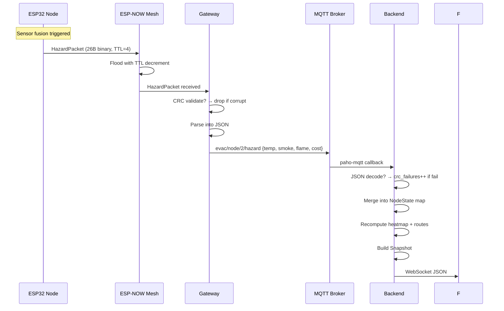

# SafeRouteAI — Protocol Specification

## 1. HazardPacket Wire Format

Every ESP32 node broadcasts its sensor state as a **26-byte packed binary struct** over ESP-NOW. The struct is `__attribute__((packed))` with no padding.

### Packet Layout

```
Offset  Size  Type         Field           Description
─────────────────────────────────────────────────────────
  0      2     uint16_t     node_id         Unique node identifier
  2      4     uint32_t     seq_num         Monotonic sequence number
  6      4     uint32_t     node_uptime_ms  Uptime at transmission (ms)
 10      4     float        temp_c          Temperature (°C)
 14      4     float        smoke_ppm       Smoke concentration (ppm)
 18      1     bool         flame_detected  IR flame sensor trigger
 19      4     float        edge_cost       Computed traversal cost
 23      1     uint8_t      ttl             Time-to-live (default: 4)
 24      2     uint16_t     crc16           CRC-16/IBM over bytes 0–25
─────────────────────────────────────────────────────────
Total: 26 bytes
```

### C Structure

```c
typedef struct __attribute__((packed)) {
    uint16_t node_id;
    uint32_t seq_num;
    uint32_t node_uptime_ms;
    float    temp_c;
    float    smoke_ppm;
    bool     flame_detected;
    float    edge_cost;
    uint8_t  ttl;
    uint16_t crc16;
} HazardPacket;
```

### Python Struct Format

```python
HAZARD_PACKET_FMT = "<H I I f f ? f B H"
#                    | | | | | | | | |
#                    | | | | | | | | +-- crc16       (uint16)
#                    | | | | | | | +---- ttl          (uint8)
#                    | | | | | | +------ edge_cost    (float)
#                    | | | | | +-------- flame_detected (bool)
#                    | | | | +---------- smoke_ppm    (float)
#                    | | | +------------ temp_c       (float)
#                    | | +-------------- node_uptime_ms (uint32)
#                    | +---------------- seq_num      (uint32)
#                    +------------------ node_id      (uint16)
HAZARD_PACKET_SIZE = struct.calcsize(HAZARD_PACKET_FMT)  # = 26
```

---

## 2. Sequence Number Anti-Replay

Sequence numbers use **RFC 1982 serial number arithmetic** to detect and reject duplicate or replayed packets.

### Algorithm

```c
bool seq_num_accept(uint16_t from_id, uint32_t seq) {
    uint32_t last = last_seq[from_id];
    if (seq == last) return false;    // exact duplicate

    // RFC 1982: accept if seq > last in modular arithmetic
    // Works as long as gap between packets < 2^31
    if ((int32_t)(seq - last) > 0) {
        last_seq[from_id] = seq;
        return true;
    }
    return false;  // old or replayed packet
}
```

### Properties

| Property | Value |
|----------|-------|
| Comparison | Signed 32-bit difference (`(int32_t)(seq - last) > 0`) |
| Max gap before ambiguity | 2,147,483,647 (2^31 − 1) |
| Time until wraparound | ~136 years at 1 packet/sec |
| Duplicate rejection | Exact match → reject |
| Replay rejection | `seq <= last` with wraparound awareness → reject |

### Python Reference Implementation

```python
def seq_num_accept(from_id, seq):
    if from_id in last_seq:
        last_s = last_seq[from_id]
        diff = seq - last_s
        if diff > 0 or (diff < 0 and last_s > 0xF0000000 and seq < 0x0FFFFFFF):
            last_seq[from_id] = seq
            return True
        return False
    else:
        last_seq[from_id] = seq
        return True
```

---

## 3. CRC16 Calculation

The CRC-16/IBM (also known as CRC-16/ARC) is computed over bytes 0 through 23 of the packet (all fields except the CRC field itself).

### Parameters

| Property | Value |
|----------|-------|
| Polynomial | `0x8005` (reflected: `0xA001`) |
| Initial value | `0xFFFF` |
| Final XOR | `0x0000` |
| Reflect input | Yes |
| Reflect output | Yes |

### C Implementation

```c
uint16_t hazard_packet_crc16(const HazardPacket *pkt) {
    const uint8_t *data = (const uint8_t *)pkt;
    uint16_t crc = 0xFFFF;
    for (int i = 0; i < sizeof(HazardPacket) - 2; i++) {  // exclude CRC field
        crc ^= data[i];
        for (int j = 0; j < 8; j++) {
            if (crc & 1) {
                crc = (crc >> 1) ^ 0xA001;  // reflected polynomial
            } else {
                crc >>= 1;
            }
        }
    }
    return crc;
}
```

### Python Implementation

```python
def crc16(data: bytes) -> int:
    crc = 0xFFFF
    for b in data:
        crc ^= b
        for _ in range(8):
            if crc & 1:
                crc = (crc >> 1) ^ 0xA001
            else:
                crc >>= 1
    return crc
```

### Verification

```c
bool hazard_packet_validate(const HazardPacket *pkt) {
    uint16_t computed = hazard_packet_crc16(pkt);
    return computed == pkt->crc16;
}
```

---

## 4. ESP-NOW Flooding Mechanism

SafeRouteAI uses **ESP-NOW connectionless broadcast** for mesh communication.

### Broadcast Method

```c
void comms_init(uint16_t node_id) {
    esp_now_init();
    esp_now_register_recv_cb(on_data_recv);
    // Register broadcast MAC
    uint8_t broadcast_mac[6] = {0xFF, 0xFF, 0xFF, 0xFF, 0xFF, 0xFF};
    comms_add_peer(broadcast_mac);
}

bool comms_broadcast(const HazardPacket *pkt) {
    esp_now_send(broadcast_mac, (const uint8_t *)pkt, sizeof(HazardPacket));
}
```

### Flooding Protocol

| Parameter | Value |
|-----------|-------|
| Transport | ESP-NOW datagram (no ACK, no retry) |
| Default TTL | 4 |
| Decrement | On every receive, before re-broadcast |
| Repeat interval | 2000ms (`REFRESH_INTERVAL_MS`) |
| Immediate trigger | Sensor rate-of-change detected |
| Forwarding | Every node re-broadcasts if `pkt.ttl > 0` |

### Receive Handler

```c
static void on_data_recv(const uint8_t *mac, const uint8_t *data, int len) {
    // 1. Length check
    if (len != sizeof(HazardPacket)) return;

    // 2. CRC validation
    HazardPacket pkt;
    memcpy(&pkt, data, sizeof(pkt));
    if (!hazard_packet_validate(&pkt)) return;

    // 3. TTL check
    if (pkt.ttl == 0) return;

    // 4. Decrement TTL
    pkt.ttl--;

    // 5. Forward to callback (which may re-broadcast)
    user_cb(&pkt);
}
```

### Flooding Characteristics

```
Node A broadcasts → all peers within radio range receive
    → each peer decrements TTL and re-broadcasts
        → their peers receive (unless already seen via anti-replay)
            → continues until TTL reaches 0
```

With `TTL = 4` and an average mesh density of ~15 nodes, the packet reaches the entire building in under 50ms.

---

## 5. MQTT Topics

The ESP32 gateway publishes sensor data to an MQTT broker (Mosquitto) running in the Docker stack.

### Topic Structure

```
evac/node/{node_id}/hazard    → Sensor readings and edge cost
evac/node/{node_id}/status    → Sensor health and failover status
evac/cmd/#                    → Command topic (subscribed by gateway)
```

| Topic | Direction | Rate | Retain |
|-------|-----------|------|--------|
| `evac/node/+/hazard` | ESP → Cloud | 0.5 Hz (periodic) + on trigger | No |
| `evac/node/+/status` | ESP → Cloud | On change only | No |
| `evac/cmd/#` | Cloud → ESP | On demand (read) | No |

---

## 6. MQTT Message Formats

### Hazard Message (`evac/node/{id}/hazard`)

```json
{
  "node_id": 2,
  "seq": 42,
  "temp": 28.5,
  "smoke": 340,
  "flame": false,
  "cost": 14.72
}
```

| Field | Type | Description |
|-------|------|-------------|
| `node_id` | integer | Numeric ESP32 node ID |
| `seq` | integer | Monotonic sequence number |
| `temp` | float | Temperature in °C |
| `smoke` | float | Smoke concentration in ppm |
| `flame` | boolean | Flame sensor trigger |
| `cost` | float | Computed edge traversal cost |

Generated by `gateway.cpp`:

```c
snprintf(payload, sizeof(payload),
    "{\"node_id\":%u,\"seq\":%lu,\"temp\":%.1f,\"smoke\":%.0f,"
    "\"flame\":%s,\"cost\":%.2f}",
    pkt->node_id, pkt->seq_num, pkt->temp_c, pkt->smoke_ppm,
    pkt->flame_detected ? "true" : "false", pkt->edge_cost);
```

### Status Message (`evac/node/{id}/status`)

```json
{
  "node_id": 2,
  "status": "SENSOR FAULT - using neighbor consensus",
  "tier": 2
}
```

| Field | Type | Description |
|-------|------|-------------|
| `node_id` | integer | Numeric ESP32 node ID |
| `status` | string | Human-readable status string |
| `tier` | integer | Failover tier (1=local, 2=neighbor, 3=static) |

### Status Strings

| Condition | Status String |
|-----------|---------------|
| All sensors healthy | `"all sensors healthy"` |
| Temp or smoke sensor fault | `"SENSOR FAULT - using neighbor consensus"` |
| Complete sensor failure | `"SENSOR FAULT - isolated, static default"` |

---

## 7. WebSocket Snapshot Format

The backend broadcasts aggregated snapshots over WebSocket at 5 Hz (`/api/events`).

```json
{
  "t": 1712345678000,
  "status": "EVACUATION_ACTIVE",
  "scenario": "flashover",
  "nodes": {
    "n-0-0-2": {
      "nodeId": "n-0-0-2",
      "online": true,
      "temperature": 28.5,
      "smoke": 0.34,
      "co": 340,
      "flameDetected": false,
      "occupants": 2,
      "nextHop": "n-0-0-3",
      "failoverTier": "primary",
      "lastSeenMs": 1712345678000,
      "sensorOk": true
    }
  },
  "hazard": {
    "0": [0.0, 0.05, 0.12, ...],
    "1": [0.0, 0.0, 0.0, ...]
  },
  "routes": [
    {
      "id": "route-n-0-0-2",
      "path": ["n-0-0-2", "n-0-0-3", "n-0-0-6"],
      "priority": 0.85
    }
  ],
  "network": {
    "totalPackets": 1423,
    "packetsPerSec": 42,
    "crcFailures": 3,
    "staleNodes": 0,
    "avgLatencyMs": 12,
    "websocket": "connected"
  },
  "activeFireNodes": ["n-0-0-7"]
}
```

### Snapshot Schema

```typescript
interface Snapshot {
  t: number;                    // Timestamp (ms)
  status: StatusEnum;           // NORMAL | FIRE_DETECTED | EVACUATION_ACTIVE
                                //   | SHELTER_IN_PLACE | NO_SAFE_EXIT
  scenario: string;             // "none" | "slow_smolder" | "flashover"
                                //   | "sensor_failure" | "comm_failure"
  nodes: Record<string, NodeState>;
  hazard: Record<string, number[]>;  // floor_index → 2D grid (cols×rows)
  routes: EvacRoute[];
  network: NetworkStats;
  activeFireNodes: string[];
}

interface NodeState {
  nodeId: string;
  online: boolean;
  temperature: number;
  smoke: number;      // 0–1 normalized
  co: number;         // ppm
  flameDetected: boolean;
  occupants: number;
  nextHop: string | null;
  failoverTier: string;  // "primary" | "secondary" | "tertiary" | "isolated"
  lastSeenMs: number;
  sensorOk: boolean;
}
```

---

## 8. Hold-Down Hysteresis Protocol

The hold-down timer prevents route oscillation under transient sensor noise. It is defined in `routing.cpp`.

### Constants

```c
#define HOLD_DOWN_MS      1800   // 1.8 second hold-down window
#define SHELTER_THRESHOLD 100000.0
```

### Algorithm

```c
bool hold_down_should_switch(uint16_t new_next_hop, uint16_t current_next_hop,
                              float new_cost, bool flame_on_current_edge,
                              uint32_t now_ms) {
    // No valid next hop — do not switch
    if (new_next_hop == 0) return false;

    // First path ever set — always accept
    if (current_next_hop == 0) {
        last_switch_ms = now_ms;
        return true;
    }

    // Flame on current edge — evacuate immediately
    if (flame_on_current_edge) {
        last_switch_ms = now_ms;
        return true;
    }

    // First path initialization
    if (!initial_path_set) {
        initial_path_set = true;
        last_switch_ms = now_ms;
        return true;
    }

    // Hold-down active AND cost is dangerously high
    uint32_t elapsed = now_ms - last_switch_ms;
    if (elapsed < HOLD_DOWN_MS && new_cost > 0.7 * SHELTER_THRESHOLD) {
        return false;  // Suppress switch during hold-down
    }

    // Hold-down expired or cost is safe — allow switch
    last_switch_ms = now_ms;
    return true;
}
```

### Decision Matrix

| Condition | Decision |
|-----------|----------|
| `new_next_hop == 0` | Reject (no route) |
| `current_next_hop == 0` | Accept (first route) |
| Flame on current edge | Accept (immediate evacuation) |
| Within 1800ms of last switch AND `new_cost > 70,000` | **Reject** (hold) |
| Outside 1800ms window | Accept |
| `new_cost <= 70,000` | Accept |

---

## 9. Packet Validation and Corruption Rejection

### Validation Pipeline

Every incoming packet passes through a 4-stage validation pipeline before its data is accepted into the link state table:

```
Raw bytes from ESP-NOW
    │
    ▼
Stage 1: Length Check
    └─ len == sizeof(HazardPacket) ? → 26 bytes expected
    │
    ▼
Stage 2: CRC16 Check
    └─ hazard_packet_validate(&pkt) → CRC over bytes 0–23 matches crc16 field?
    │
    ▼
Stage 3: TTL Check
    └─ pkt.ttl > 0 → drop packets that have fully propagated
    │
    ▼
Stage 4: Sequence Number Anti-Replay
    └─ seq_num_accept(pkt->node_id, pkt->seq_num) → RFC 1982 check
    │
    ▼
Accept → link_state_upsert()
```

### Corruption Detection

- **CRC mismatch:** The packet is silently dropped. Backend tracks `crc_failures` in `NetworkStats`.
- **Malformed JSON (MQTT):** The MQTT bridge increments `crc_failures` and discards the message.
- **Injector corrupt mode:** The simulator's `injector.py` supports a `--corrupt` flag that sets CRC to 0, which the firmware will reject on every node.

```python
# injector.py — corrupt mode
def build_hazard_packet(..., corrupt=False):
    data_bytes = struct.pack(...)
    if not corrupt:
        crc = crc16(data_bytes)
    else:
        crc = 0  # Guaranteed to fail validation on ESP32
    data_bytes += struct.pack("<H", crc)
    return data_bytes
```

### MQTT JSON Validation

```python
def _handle_hazard(self, topic: str, payload: str):
    try:
        data = json.loads(payload)
    except json.JSONDecodeError:
        self._crc_failures += 1  # Count as corruption
        return
```

---

## 10. Communication Protocol Summary


